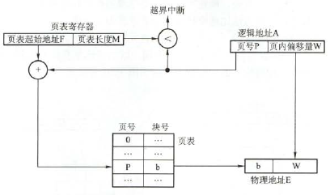
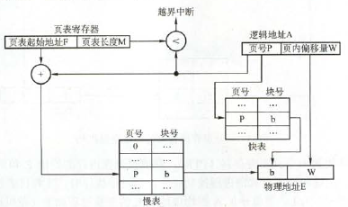
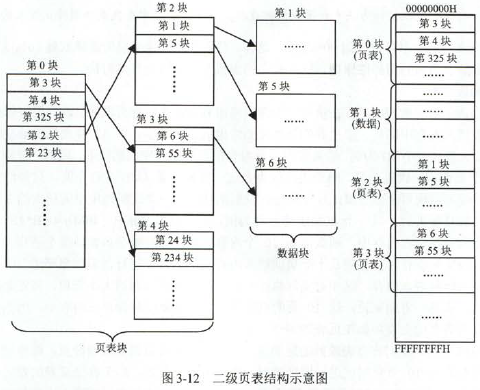
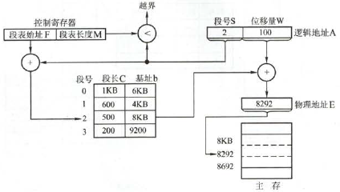
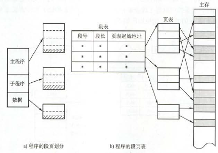
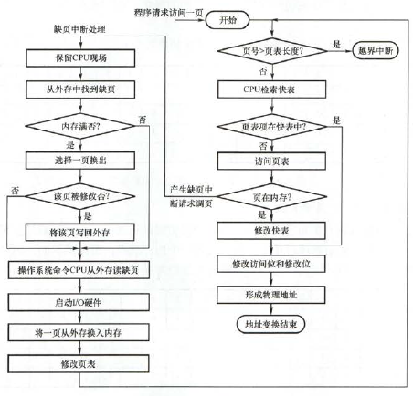
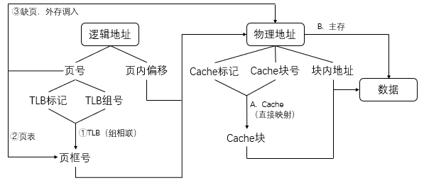

# 内存管理

## 内存管理基础

- **用户源程序的执行过程**：$\mathrm{用户源代码} \overset{编译}{\longrightarrow} \mathrm{目标模块} 
 \overset{链接}{\longrightarrow} \mathrm{装入模块} \overset{装入}{\longrightarrow} \mathrm{内存}$
    1. **编译**：**编译程序**将**用户源代码**编译成若干**目标模块**
    2. **链接**：**链接程序**将目标模块与所需的库函数链接，形成**装入模块**
        - **三种方式**：**静态链接**、**装入时动态链接**、**运行时动态链接**
    3. **装入**：**装入程序**将装入模块装入内存运行
        - **三种方式**
            - **绝对装入**：只适用于**单道程序环境**
            - **可重定位装入（静态重定位）**：作业装入内存需要一次性分配全部空间，且装入后不能移动
            - **动态运行时装入（动态重定位）**：程序装入后可以移动，分配到不连续的存储区中，且可以动态申请分配内存。需要**重定位寄存器**支持
- **地址空间**
    - **逻辑地址空间**：每个目标模块内从0开始编址。链接程序将它们链接成装入模块后，相对地址（逻辑地址）改为装入模块内的地址，也是从0开始
    - **物理地址空间**：内存中的实际地址
    - **地址重定位**：装入程序将逻辑地址转换为物理地址的过程
- **内存保护两种方法**
    - 设置**上、下限寄存器**，每次访问分别比较判断越界
    - 采用**重定位寄存器（基址寄存器）**和**界地址寄存器（限长寄存器）**，前者用来加得物理地址，后者用来比较逻辑地址判断越界
- **扩充内存两种方法**
    - **覆盖**：将用户空间分为**固定区**和**覆盖区**。固定区存放程序中经常活跃的部分保持不变，覆盖区不断从外存调入替换需要调用的片段
        - 应用于同一进程/程序
        - 同时运行的代码量不能大于主存
        - 已过时，被虚存代替
    - **交换**：把内存中暂时不运行（就绪/阻塞）的程序**换出**外存，把外存中可以运行的**换入**内存
        - 应用于不同进程/作业
        - **两类**
            - **整体交换**：以整个进程为单位交换，即**中级调度**
            - **页面（分段）交换**：以进程的页面/分段为单位交换，用于**虚存**
- **管理内存两种方式**
    - **连续分配管理方式**
        - **单一连续分配**：将内存分为**系统区**和**用户区**，系统区通常在低地址
            - 只适用于单道程序环境，无需内存保护
        - **固定分区分配**：将用户区分为若干定长区域，分区大小可能相等或不等。装入程序时检索**分区说明表**找到合适分区来分配
            - 最简单的多道程序存储管理方式
            - 程序可能大到放不进任何分区；分区内部存在**内部碎片**
        - **动态分区分配（可变分区分配）**：动态建立恰好大小的分区装入进程
            - 随着时间推移会积累**外部碎片**，可通过**紧凑**技术调整
            - **分配策略**
                - **首次适应**：最小地址空闲分区
                - **最佳适应**：最小容量空闲分区
                - **最坏适应（最大适应）**：最大容量空闲分区
                - **邻近适应（循环首次适应）**：接上一次查找的首次适应
    - **非连续分配管理方式**
        - **分页存储管理方式**：进程、内存、外存都分成大小相同的块，分别称为**页**、**页框**、**块**。进程按页申请主存空间
            - **优点**：**内存利用率高**
            - **分类**：**基本分页存储**需要把作业所有页面装入才能运行，**请求分页存储**（虚存）不需要。这里只讨论前者
            - **页内碎片**：进程最后一个申请的块不完全利用
            - **页面大小**：一般为2的整数幂。过小会导致页表过长，过大会增加页内碎片
            - **逻辑地址结构**：**页号 + 页内地址**
            - **页表**：存在内存中，页表项为**页号**与对应的**块号**
            - **基本地址变换机构**
                - 
                - 地址转换必须足够快，否则访存速度慢
                - 页表不能太大，否则内存利用率低
            - **快表地址变换机构**
                - 
            - **两级页表**
                - 
                - **优点**：将页表再次拆分，避免连续过长的页表；可以只将当前需要的页表项调入内存，其余仍留在磁盘
                
                !> 二级指较高的一级

        - **分段存储管理方式**：按进程中的自然段（子程序、栈、数据等）划分空间，段内连续，段间不连续
            - **优点**：**反映程序逻辑结构，且有利于段的共享**
            - **逻辑地址结构**：**段号 + 段内偏移量**
            - **段表**：段表项为**段号**、**段长**、**本段在主存的始址**
            - **地址变换机构**
                - 
                
                !> 上图不完整，还要判断W和C防止越界

        - **段页式存储管理方式**：结合页式和段式优点
            - 
            - **逻辑地址结构**：**段号 + 页号 + 页内偏移量**
            
            !> 一个进程只有一个段表，但可能有多个页表


## 虚拟内存管理

- **含义**：系统提供部分装入、请求调入和置换功能后，给用户感觉在使用一个比实际物理内存大得多的存储器
- **特征**
    - **传统存储**：**一次性**、**驻留性**
    - **虚拟存储**：**多次性**、**对换性**、**虚拟性**
- **实现方式**：**请求分页存储**（以下仅讨论）、请求分段存储、请求段页式存储
    - **请求分页管理方式**：基本分页管理 + **请求调页 + 页面置换**
    - 
- **需要的机构**
    - **页表机构**
        - **页表项**：页号 + 块号 + **状态位 + 访问字段 + 修改位 + 外存地址**
        - **状态位**：该页是否已调入内存
        - **访问字段**：最近访问次数，或多久没被访问。供置换算法参考
        - **修改位**：调入内存后是否被修改过
        - **外存地址**：该页在外存的地址，通常是物理块号
    - **缺页中断机构**：缺页时产生缺页中断，阻塞进程，调页或换页后再唤醒
        - 与普通中断的不同
            - 在指令执行期间而非之后中断，属于内部中断
            - 一条指令可能产生多次缺页
    - **地址变换机构**
    - **一定的内存外存**
- **页面置换算法**
    - **最佳置换算法OPT**
        - **淘汰页面**：**从现在起未来最长时间不被访问的页面**
        - **实现**：因无法预判未来，**无法实现**，但可以**用来评价其他算法**
    - **先进先出置换算法FIFO**
        - **淘汰页面**：**驻留时间最长的页面**
        - **实现**：**队列**
        - 可能存在**Belady异常**：分配的物理块数增多，但缺页次数却也增加
    - **最近最久未使用置换算法LRU**
        - **淘汰页面**：**最近最久未访问的页面**
        - **实现**：**双向链表 + HashMap** （O(1)）
    - **时钟置换算法CLOCK（最近未用算法NRU）**
        - **简单CLOCK算法**：引入**使用位**
            ```python
            # 初始化块数为n, 指针i=0, 使用位数组u[n]全置0
            def replace(t):
                替换第t页
                u[t]=1
            
            if 命中(第x页):
                replace(x)
            else:
                while u[i]==1:
                    u[i]=0
                    i=(i+1)%n
                replace(i)
                i=(i+1)%n
            ```

        - **改进CLOCK算法**：引入**使用位**和**修改位**
            ```python
            # 初始化块数为n, 指针i=0, 使用位数组u[n]全置0, 修改位数组m[n]全置0
            # 按顺序淘汰(u[n],m[n])=(0,0)->(0,1)->(1,0)->(1,1)
            def replace(t,modified):
                替换第t页
                u[t]=1
                m[x]=modified   # 是否修改
            
            if 命中命中(第x页):
                replace(x,modified)
            else:
                while true:     # 最多循环两轮
                    # 找u[i]==0且m[i]==0
                    cnt=0
                    while cnt<n and not(u[i]==0 and m[i]==0):
                        i=(i+1)%n
                        cnt+=1
                    if cnt<n:
                        replace(i,modified)
                        i=(i+1)%n
                        break

                    # 找u[i]==0且m[i]==1
                    cnt=0
                    while cnt<n and not(u[i]==0 and m[i]==1):
                        u[i]=0;     # !!!
                        i=(i+1)%n
                        cnt+=1
                    if cnt<n:
                        replace(i,modified)
                        i=(i+1)%n
                        break
            ```

            - **优点**：修改过的页在被替换前必须写回，由此节省时间
    
    !> 性能排序为 OPT > LRU ≈ CLOCK > FIFO，实现难度LRU > CLOCK > FIFO

- **页面分配策略**
    - **驻留集**：给一个进程分配的物理页框的集合
    - **分配策略**：**固定分配局部置换**、**可变分配全局置换**、**可变分配局部置换**
    
    !> “固定”/“可变”指进程的驻留集固定/可变；“全局”/“局部”指置换时淘汰的页面可以/不可以属于其他进程

    - **调页时机**
        - **预调页**：运行前调入。主要用于进程的首次调入
        - **请求调页**：运行时调入。每次只调入一页
    - 请求调页的**调页来源**
        - **若系统拥有足够对换区空间**：将所需文件从文件区复制到对换区，然后全部从对换区调入
        - **若系统缺少足够对换区空间**：直接从文件区调入。对于不会修改的文件，不必调出；对于可能修改的文件，调出到对换区，需要时再在对换区调入
        - **UNIX方式**：未运行过的页面都从文件区调入，运行过又被换出的页面则从对换区调入。UNIX允许页面共享，其他进程已调入的页面无须重复调入

        !> 外存分为**对换区**和**文件区**，前者读写更快

- **抖动（颠簸）**
    - **含义**：某页换出后马上又调入，或反过来。换页耗时大于执行耗时
    - **主要原因**：频繁访问页数大于可用物理页数
- **工作集**
    - **含义**：某段时间内，进程要访问的页面集合
    - 给定页面访问次序，可以设定**工作集窗口大小**$\Delta$，得到某时间的**工作集大小**。一般为防抖动，**驻留集大小 > 工作集大小**
- **从逻辑地址到数据的过程总结**
    - 
    
    !> TLB是页表的子集，Cache是主存的子集
