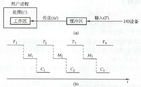
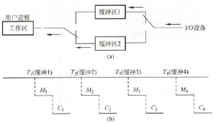

## 输入输出(I/O)管理 <!-- {docsify-ignore} -->

### I/O管理概述

- **I/O控制方式**（见计组笔记）
- **I/O软件层次结构**
    - **用户层I/O软件**：通过系统调用，实现交互接口
    - **设备独立性软件**：向用户层提供与设备驱动器的*统一*接口
    - **设备驱动程序**：协调上层抽象的I/O与下层设备控制器具体操作
    - **中断处理程序**
    - **硬件设备**

### I/O核心子系统

- **作用**：将内核从I/O管理中解放，缓和CPU与I/O设备的速度不匹配
- **服务**
    - **I/O调度**：确定执行I/O请求的顺序
    - **高速缓存与缓冲区**
        - **磁盘高速缓存**：不是传统意义的Cache，而是利用**内存**暂存部分常用磁盘盘块的数据，从而减少磁盘I/O次数。逻辑上属于磁盘，物理上属于内存
        - **缓冲区**
            - **实现**：一般用位于内存的**缓冲区**，而不用高成本的**硬件缓冲器**
            - **特点**：**非空不写，写则写满**
            - **缓冲区个数**
                - **单缓冲与双缓冲**
                    - **单缓冲**
                        - 
                    - **双缓冲**
                        - 
                        - 增加了处理机和I/O设备的并行程度
                    - 默认工作区和任一块缓冲区大小相等
                    - 要会列出时刻与缓冲区状态（0/1）关系，计算耗时
                    
                    !> 总耗时≠单块耗时×块数
                    
                - 循环缓冲：缓冲区构成循环队列（头尾指针）
                - 缓冲池：设置空队列、收容输入队列、输入队列、收容输出队列、输出队列五个队
    - **设备分配与回收**
        - **三种设备**
            - **独占设备**：如打印机
            - **共享设备**：分时共享，如磁盘
            - **虚拟设备**：以SPOOLing方式使用
        - **设备分配数据结构**
            - **设备控制表DCT**：记录设备属性。设备、DCT、COCT一一对应
            - **控制器控制表COCT**
            - **通道控制表CHCT**：一个通道为多个控制器服务⇒一个CHCT对应多个COCT
            - **系统设备表SDT**：只有一张，每个表目对应一个物理设备
        - **设备分配数据结构访问顺序**：SDT→DCT→COCT→CHCT。必须要设备可用、控制器可用、通道可用
        - **设备分配原则**：充分使用设备，避免进程死锁（安全性），程序设备隔离
        - **逻辑设备表LUT**：**逻辑设备名** → **物理设备名**
    - **假脱机技术SPOOLing**
        - 
        - **流程**：以输入为例，输入进程控制数据从输入设备→输入缓冲区→输入井，等CPU要读取时再输入井→内存
        - **本质**：**以空间换时间**
        - **特点**：提高I/O速度；将独占设备改为共享设备；实现了虚拟设备
        - **应用例**：共享打印机
