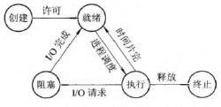
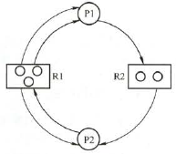

# 进程管理

## 进程与线程

- **进程**
    - **概念**
        - **进程控制块PCB**：描述进程情况的专门数据结构；**进程存在的唯一标志**
        - **进程映像（进程实体）**：**PCB + 程序段 + 相关数据段**
        - **进程**：进程实体的运行过程，系统进行资源分配和调度的独立单位
        
        !> 不同进程**可以**运行同一程序

    - **特征**：**动态性**、并发性、独立性、异步性、结构性
        
    !> 进程是动态的，进程映像是静态的

    - **进程状态**
        - **五种状态**
            - **基本状态**
                - **运行态**：正在运行
                - **就绪态**：准备运行（缺处理机）
                - **阻塞态（等待态）**：暂停运行（等待某一事件）
            - **创建态**：正在创建（就绪态之前）
            - **结束态**：正在结束
        - **状态转换**
            - 
    - **进程控制**（一般通过**原语**）
        - **进程创建**
            - **子进程**被**父进程**创建，并继承其资源，具有层次关系（Windows除外）
            - **事件**：用户登录、作业调度、提供服务、应用请求
            - **过程**：申请空白PCB和唯一PID→分配资源→初始化PCB→插入就绪队列
        - **进程终止**
            - **事件**：**正常结束**、**异常结束**、**外界干预**
            - **过程**：根据PID检索PCB→终止执行→终止子进程→归还资源给父进程/OS→移出队列
        - **进程阻塞与唤醒**
            - **事件**：请求共享资源失败、等待某操作完成、新数据尚未到达、无新工作
            - **阻塞过程**：根据PID检索PCB→运行态转阻塞态→插入相应事件等待队列
            - **唤醒过程**：相应事件等待队列中找到PCB并移出→阻塞态转就绪态→插入就绪队列
        - **进程挂起与激活**
            - **过程**：就绪↔**静止就绪**，阻塞↔**静止阻塞**；调整相关队列；检查调度
    - **PCB的记录信息**
        - **进程标识符**：外部标识符、内部标识符
        - **处理机状态**：通用寄存器、PC、PSW、栈指针
        - **进程调度信息**：进程状态、优先级、阻塞原因（事件）、其他调度相关信息
        - **进程控制信息**：程序和数据地址、进程同步和通信相关信息（消息队列指针、信号量）、资源清单、链接指针（所在队列中下一个PCB）
    - **PCB的组织方式**
        - **线性**：一张线性表
        - **链接**：相同状态放在同一**队列**
        - **索引**：相同状态放在同一**索引表**
    - **进程（高级）通信**：**高级**指高效传输**大量数据**（PV属于低级通信）
        - **共享存储**：OS提供共享存储空间和同步互斥工具，用户安排I/O指令进行数据交换
            - **基于共享数据结构（低级）**：如生产者–消费者问题
            - **基于共享存储区（高级）**
        - **管道通信**：通过**管道**作为缓冲区，**半双工**地通信
            - **管道**：连接**读进程**和**写进程**的**共享文件**（pipe文件）
            - **管道机制具备协调能力**
                - **互斥**：同时只有一个进程读写
                - **同步**：限制管道大小，满/空则等待
                - **确定对方存在**
            
            !> 数据被读后即从管道销毁

        - **消息传递**：进程间数据交换以格式化的消息（报文）为单位
            - **直接通信**：直接把消息发送到接收进程的**消息缓冲队列**
            - **间接通信（信箱通信）**：把消息发送到某个中间实体（**信箱**）
        - 客户端-服务器
- **多线程**
    - **线程与进程的关系**
        |                  |          进程           |                    线程                    |
        | :--------------: | :---------------------: | :----------------------------------------: |
        |   **引入目的**   |      增加并发程度       |             减小并发的时空开销             |
        |   **映像组成**   | PCB、程序段、相关数据段 |         线程ID、寄存器集合、堆栈等         |
        |    **并发性**    |      多个进程并发       |            一个进程并发多个线程            |
        |     **调度**     |                         |           **独立调度的基本单位**           |
        |     **资源**     | **资源分配的基本单位**  | 几乎不拥有资源，但可以访问其隶属进程的资源 |
        |     **通信**     |   进程同步和互斥手段    |    同进程的各线程通信直接读写进程数据段    |
        |   **地址空间**   |  进程地址空间相互独立   |       同进程的各线程共享进程地址空间       |
        |   **切换开销**   |           大            |                     小                     |
        |    **控制块**    |           PCB           |                    TCB                     |
        | **支持多处理机** |    ×（单线程不支持）    |              √（多线程支持）               |
    
    !> 线程不能脱离进程运行；多线程系统中进程**不是**可执行实体；线程和进程有一样的状态和状态转换

    - **实现方式**
        - **用户级线程**：应用程序完成所有线程管理工作，内核意识不到线程存在
            - **优点**：**不用切换到内核态，节省开销；调度算法可以进程专用**
            - **缺点**：**一个线程阻塞会导致同进程所有线程阻塞；不能利用多处理器**
            
            !> 用户级线程系统的调度仍以**进程**为单位

        - **内核级线程（内核支持线程）**：内核完成所有线程管理工作，应用程序没有线程管理代码
            - 优缺点和用户级线程相反
        - **组合方式**：X个用户级线程映射到Y个内核级线程
            - **多对一模型**
            - **一对一模型**（X=每）
            - **多对多模型**

## 处理机调度

- **定义**：按调度算法，将处理机分配给就绪队列中的一个进程，实现进程并发
- **层次**
    - **高度调度（作业调度，长程调度）**：挑选外存上处于后备队列的若干作业，调入内存，建立进程，分配资源，放入就绪队列
        - 一般**只用于多道批处理系统**
        - 调度频率最低
    - **低级调度（进程调度，短程调度）**：挑选就绪队列的进程分配处理机
        - **最基本**的调度，不可或缺
        - 调度频率最高
    - **中度调度（内存调度，中程调度）**：将就绪队列中暂时不能运行的进程挂起，调回外存等待；反之亦然（重新激活，调回内存）
- **进程调度与切换时机**
    - **不能调度与切换的情况**
        - **处理中断过程中**
        - **进程在OS内核程序临界区中**
        - **其他完全屏蔽中断的原子操作过程中**：加/解锁、中断现场保护/恢复
    - **应该调度与切换的情况**
        - 满足引起调度的条件，且当前进程无法继续运行（对应**非剥夺调度**）
        - 中断/异常处理结束后，在返回被中断进程前，若**请求调度标志**被标记（对应**剥夺调度**）
- **进程调度方式**
    - **非剥夺调度（非抢占）**：进程直到终止或阻塞才交还处理机
        - **优点**：实现简单，系统开销小
        - 适用于大多数**批处理系统**
    - **剥夺调度（抢占）**：进程执行时可以被更重要的进程抢占，暂停使用处理机
        - **优点**：提高系统吞吐率和响应效率
        - **抢占原则**：优先权原则、短进程优先、时间片原则
        - 现代OS广泛采用（**分时系统**和**实时系统**）
- **调度的基本准则（性能指标）**
    - **对单个作业/进程**
        - **提交时间**、**开始时间**、**完成时间**
        - **运行时间**：**完成时间 - 开始时间**
        - **等待时间**：**开始时间 - 提交时间**
        - **周转时间**：**完成时间 - 提交时间**。多个作业则为平均~
        - **带权周转时间**：**周转时间 / 运行时间**。多个作业则为平均~
        - **响应时间**：**系统首次响应时间 - 提交时间**，一般用于交互式系统
    - **对系统**
        - **CPU利用率**：**CPU有效工作时间 / 总时间**
        - **系统吞吐量**：**CPU完成作业数 / 总时间**
- **调度算法**
    - **先来先服务算法FCFS**
        - 简单但效率低；**对短作业不利**；有利于CPU繁忙型作业，不利于I/O繁忙型作业
    - **短作业优先算法SJF**
        - **对长作业不利**，“饥饿”现象；完全不考虑紧迫程度；按用户估计运行时间调度，**未必做到真正的短作业优先**
        - **平均等待时间、平均周转时间最少**
    - **优先级算法**
        - 根据进程创建后优先级能否改变分为**静态优先级**、**动态优先级**
        - 一般来说优先级遵循：**系统进程>用户进程**、**交互型进程>非交互型进程**、**I/O型进程>计算型进程**
    - **高响应比优先算法**
        - 主要用于**作业调度**
        - 响应比$R_P=\frac{等待时间+估计运行时间}{估计运行时间}$。类似带权周转时间
        - 响应比随等待时间增加而提高，从而克服饥饿，兼顾长作业
    - **时间片轮转算法**
        - 主要用于**分时系统**
        - 按到达时间排成队列，取队头来服务，但只能运行一个**时间片**，然后抛至队尾
        - 时间片过大则FCFS，过小则频繁切换、增加处理机开销
    - **多级反馈队列算法**
        - 由多级队列组成，优先级逐级降低，时间片逐级倍增，级内按FCFS。新进程丢进第一级，若时间片过后未完成则丢到下一级排队
        - 综合了时间片轮转算法和优先级算法
    
    !> 前四个都分为**非剥夺式**和**剥夺式**，后两个必为剥夺式

- **甘特图**：资源分配与时间的关系图，**横轴时间，纵轴程序/作业**；用不同的线标注不同资源的占用

## 同步与互斥

- **临界资源**：一次只为一个进程使用的资源，必须互斥地访问。如打印机等
    - **访问过程**
        1. **进入区**：检查可否进入临界区，并设置访问标志
        2. **临界区（临界段）**：访问临界资源的那段代码
        3. **退出区**：清除临界区访问标志
        4. **剩余区**：代码中其余部分
- **同步（直接制约关系）**：协调工作次序
- **互斥（间接制约关系）**：临界资源互斥访问
- **同步机制几个准则**：**空闲让进**、**忙则等待**、**有限等待**、**让权等待**
- **实现互斥的几种基本方法**
    - **软件实现**（以P0、P1两个进程为例）
        |         方法         |                   P0进入区代码                   |   P0退出区代码   |                特点                |
        | :------------------: | :----------------------------------------------: | :--------------: | :--------------------------------: |
        |       单标志法       |                `while(turn!=0);`                 |    `turn=1;`     |      两进程必须交替进入临界区      |
        |    双标志法先检查    |         `while(flag[1]); flag[0]=TRUE;`          | `flag[0]=FALSE;` | 两进程可能同时进入临界区（不互斥） |
        |    双标志法后检查    |         `flag[0]=TRUE; while(flag[1]);`          | `flag[0]=FALSE;` |    两进程可能“互相谦让”（饥饿）    |
        | Peterson's Algorithm | `flag[0]=TRUE; turn=1; while(flag[1]&&turn==1);` | `flag[0]=FALSE;` |         保证互斥且不会饥饿         |

    - **硬件实现**
        - **关中断**：进入区关中断，退出区开中断
            - **原理**：CPU只在中断时引起进程切换，因此关中断可以保证互斥
            - **缺点**：限制了处理机交替执行程序的能力；把关中断权力交给用户
        - **TestAndSet硬件指令**
            - **指令功能**：一条原语，读出指定标志（lock）并置为真
            - **进入区代码**：`while(TestAndSet(&lock));`
            - **退出区代码**：`lock=FALSE;`
        - **Swap硬件指令**：
            - **指令功能**：一条原语，交换两个字的内容
            - **进入区代码**：`key=TRUE; while(key)Swap(&lock,&key);`
            - **退出区代码**：`lock=FALSE;`
            
            !> `key`是进程局部变量，`lock`是全局变量

    !> 以上方法在临界资源忙碌时，其他访问进程处于**忙等**状态，即**不遵循让权等待**

- **信号量（Semaphore）**：通过两个**原语** **P操作(wait，申请资源)** 和 **V操作(signal，释放资源)** 解决同步和互斥问题
    - **两种信号量**
        - **整型信号量**：**不遵循让权等待**
            ```cpp
            void P(int S){while(S<=0); S--;}
            void V(int S){S++;}
            ```
            
        - **记录型信号量**：**遵循让权等待**
            ```cpp
            typedef struct{
                int value;  // 空闲资源数
                struct process *L;  // 等待该资源的进程队列
            } semaphore;

            void P(semaphore S){
                if (--S.value<0)
                    当前进程入队S.L，并调用block原语自我阻塞;
            }

            void V(semaphore S){
                if (++S.value<=0)
                    从S.L出队一个进程，并调用wakeup原语唤醒;
            }
            ```

    - **实现同步（前驱关系）**
        ```cpp
        // 例如y语句需要x语句运行后运行
        struct semaphore S={0}; // 初始无资源
        void P1(){
            ...
            x; V(S);
            ...
        }
        void P2(){
            ...
            P(S); y;
            ...
        }
        ```

    - **实现互斥**
        ```cpp
        struct semaphore mutex={1}; // 初始有资源
        void P1(){
            ...
            P(mutex);
            ... // 临界区
            V(mutex);
            ...
        }
        void P2(){
            ...
            P(mutex);
            ... // 临界区
            V(mutex);
            ...
        }
        ```

- **管程**：另一种同步互斥工具，一个OS的资源管理模块
    - **组成**：代表共享资源的数据结构、对该数据结构进行操作的一组过程
    - 每次只允许一个进程进入，完全由编译程序保证
- **[经典同步问题](https://www.cnblogs.com/ericling/p/13671562.html)**
    - **生产者-消费者问题**
        ```cpp
            semaphore mutex=1, empty=n, full=0;
            producer(){
                while (1) {
                    生产; p(empty); p(mutex); 放入; v(mutex); v(full);
                }
            }
            consumer(){
                while (1) {
                    p(full); p(mutex); 取出; v(mutex); v(empty); 消费;
                }
            }
        ```

    - **复杂生产者-消费者问题**
    - **读者-写者问题**(注意**写优先**)
        ```cpp
            int count=0;
            semaphore mutex=1, rw=1, w=1;
            writer(){
                while(1){
                    p(w);               // !!!
                    p(rw); 写; v(rw);
                    v(w);               // !!!
                }
            }

            reader(){
                while(1){
                    p(w);               // !!!
                    p(mutex);
                    if (count==0) p(rw);
                    count++;
                    v(mutex);
                    v(w);               // !!!
                    读;
                    p(mutex);
                    count--;
                    if (count==0) v(rw);
                    v(mutex);
                }
            }
        ```

    - **哲学家进餐问题**(注意**死锁**)
    - **吸烟者问题**

## 死锁

- **定义**：多个进程因竞争资源而造成的互相等待的僵局
- **必要条件**
    - **互斥条件**：资源只能同时被一个进程占有
    - **不剥夺条件**：资源不可被剥夺
    - **请求并保持条件**：进程请求新资源的同时，不会释放已有资源
    - **循环等待条件**：存在循环等待的进程环
- **处理策略**
    - **预防死锁**：破坏几个必要条件
        - **破坏互斥条件**：不可行
        - **破坏不剥夺条件**：释放已获得的资源
        - **破坏请求并保持条件**：在运行前一次性申请完所需资源
        - **破坏循环等待条件**：给系统资源编号，每个进程增序地申请资源，且同类资源一次申请完
    - **避免死锁**：避免系统不安全状态
        - **系统安全状态**
            - **定义**：系统能找到某种进程推进顺序（**安全序列**）P1、P2、……、Pn，为每个进程分配其所需资源直到满足其最大需求，使每个进程都可顺序完成
            - 系统安全状态是系统不死锁的**充分条件**
        - **银行家算法**（核心是**安全性算法**，很好理解）
            ```cpp
                int available[m];       // 系统中j类资源有available[j]个
                int max[n][m];          // 进程i对j类资源最大需求为max[i][j]
                int allocation[n][m];   // 进程i对j类资源已拥有allocation[i][j]个

                int need[n][m];
                for(int i=0;i<n;i++)
                    for(int j=0;j<m;j++)
                        need[i][j]=max[i][j]-allocation[i][j];

                // 安全性算法
                bool BankSafe()
                {
                    int i,j,k,cnt=0;
                    int work[m];
                    bool finish[n];

                    for(j=0;j<m;j++) work[j]=available[j];
                    for(i=0;i<m;i++) finish[i]=false;
                    for(i=0;i<n;i++)
                    {
                        if (finish[i]) continue;
                        for(j=0;j<m;j++)
                            if (need[i][j]>work[j])
                                break;
                        if (j==m)
                        {
                            finish[i]=true;
                            for(k=0;k<m;k++)
                                work[k]+=allocation[i][k];  // 释放资源
                            cnt++;
                            i=-1;   // 重头继续找行
                        } else if (cnt==n) return true;
                    }
                    return false;
                }

                // 第i个进程请求资源，第j类资源需要request[j]个
                bool Request(int i,int request[])
                {
                    for(int j=0;j<m;j++)
                    {
                        if (request[j]>need[i][j])
                        {
                            cout<<"错误：请求过量资源\n";
                            return false;
                        }
                        if (request[j]>available[j])
                        {
                            cout<<"等待\n";
                            return false;
                        }
                    }

                    // 试探允许分配
                    for (int j=0;j<m;j++) 
                    {
                        available[j]-=request[j];
                        allocation[i][j]+=request[j];
                        need[i][j]-=request[j];
                    }

                    // 检测安全性
                    if (BankSafe())
                    {
                        cout<<"安全\n";
                        return true;
                    }

                    // 撤回分配
                    for (int j=0;j<m;j++) 
                    {
                        available[j]+=request[j];
                        allocation[i][j]-=request[j];
                        need[i][j]+=request[j];
                    }
                    cout<<"不安全\n";
                    return false;
                }

            ```

    - **检测和解除死锁**：出现死锁再补救
        - **资源分配图**：○是一个进程；□是一类资源，里面的圆表示最初的资源个数；进程到资源的边表**请求一个**资源；资源到进程的边表**分配一个**资源。
            - 
        - **死锁检测**
            - 若一个进程的要求可以*被满足*，则与它相关的边都可以删去（即释放资源）
            - **死锁定理**：死锁 ⇔ 不能把所有边都删去，即不可**完全简化**
        - **死锁解除**：**资源剥夺法**、**撤销进程法**、**进程回退法**
