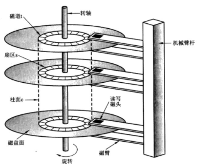
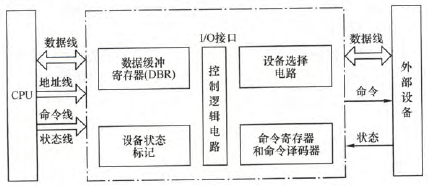
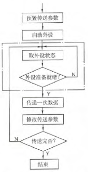
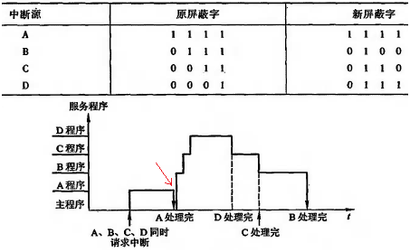
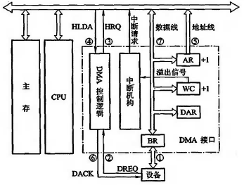
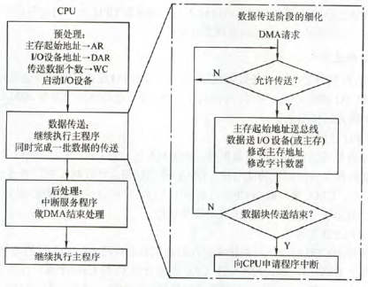

## I/O系统 <!-- {docsify-ignore} -->

### I/O系统基本概念

- **外部设备**：包括I/O设备和通过I/O接口才能访问的外存储设备
	- **I/O接口**：协调外设与主机传输的逻辑部件，包括速度匹配、电平和格式转换
- **I/O系统的组成**
	- **I/O硬件**：外部设备、设备控制器和接口、I/O总线等
		- 通过设备控制器控制I/O设备
		- 通过I/O接口与主机相连
	- **I/O软件**：驱动程序、用户程序、管理程序等
		- 通过I/O指令和通道实现信息交换

### 外部设备

- **输入设备**
	- **键盘**：薄膜式、机械式、导电橡胶式
	- **鼠标**：机械式、光电式
- **输出设备**
	- **显示器**
		- **分类**：阴极射线管（CRT）、液晶（LCD）、发光二极管（LED）
		- **性能参数**：
			- **屏幕大小**：以**对角线长度**表示
			- **分辨率**：所能表示的像素个数
			- **灰度级（色深）**：黑白（彩色）显示器中像素点亮暗（颜色）的不同。如8位、16位
			- **刷新频率（帧频）**：单位时间内扫描整个屏幕内容的次数。>30Hz
			- **显存（VRAM）**
				- VRAM容量 = 分辨率 × 灰度级位数
				- VRAM带宽 = 分辨率 × 灰度级位数 × 刷新频率
	- **打印机**：针式、喷墨式、激光
- **外存**
	- **硬盘存储器**
		- **分类**
			- 固定磁头和移动磁头
			- 可换盘和固定盘
			- *注：**温彻斯特盘（温盘）** 是一种可移动磁头、固定盘片的硬盘存储器*
		- **组成**
			- **磁盘驱动器**：核心是磁头组件和盘片组件
			- **磁盘控制器**：硬盘存储器和主机的接口。如IDE、SCSI、SATA
			- **盘片**
				- 一个硬盘有**柱面数**个**磁道**、**磁头数**个**记录面**
				- 一个磁道的一个记录面上有**扇区数**个**扇区（块）**（磁盘读写最小单位，按块存取）
				- *注：最外圈叫0磁道；磁道的扇区数不一定相等*
				- 
		- **磁记录原理**：磁头和磁性介质相对运动，通过电磁转换完成读写
			- **磁记录方式**：**调频制（FM）**、**改进型调频制（MFM）**
		- **性能参数**
			- **容量**
				- **非格式化容量**：磁记录表面可利用的磁化单元总数
				- **格式化容量**：按照某种特定记录格式所能存储的信息总量
			- **记录密度**
				- **道密度**：径向单位长度的磁道数
				- **位密度**：磁道单位长度的记录位数
				- **面密度**：道密度 × 位密度。即盘片单位面积的记录信息量
			- **平均存取时间**
                |                  |        动作        |   决定因素   |               平均               |
                | :--------------: | :----------------: | :----------: | :------------------------------: |
                |   **寻道时间**   | 磁头移动到目的磁道 | 磁盘调度算法 | 磁头从n磁道移动到0磁道时间的一半 |
                | **旋转延迟时间** | 磁头定位到所在扇区 |   磁盘转速   |        盘片旋转周期的一半        |
                |   **传输时间**   |      传输数据      |   磁盘转速   |                -                 |

			- **数据传输率**：$D_r=rN$，其中$r$为磁盘转速，$N$为每磁道的容量
		- **编址**：**驱动器号 | 柱面（磁道）号 | 盘面号 | 扇区号**
		- **工作过程**：主要操作是**寻址**、**读盘**、**写盘**，分别对应一个控制字。工作时先取控制字，再执行控制字
		- *注：硬盘读写操作是**串行**的*
	- **磁盘阵列（RAID）**：使用多个磁盘并行存取提高传输率，通过镜像和数据校验提高可靠性
		- **分级**
			- **RAID0**：无冗余无校验
			- **RAID1**：**镜像**
			- **RAID2**：采用**海明码**纠错
			- **RAID3**：**位交叉奇偶校验**
			- **RAID4**：**块交叉奇偶校验**
			- **RAID5**：**无独立校验奇偶校验**
		- **条带化**：把连续数据分割成块，分别写入不同磁盘，从而在顺序访问时获得最大程度的I/O并行能力
	- **光盘存储器**：用聚焦激光束非接触地对盘式介质记录信息
		- 组成：光盘驱动器、光盘控制器、光盘片、光盘驱动软件
		- 分类：CD-ROM（只读）、CD-R（可写一次）、CD-RW（可读/写）、DVD-ROM（高质量CD-ROM）

### I/O接口(I/O控制器)

- **功能**
	- 实现主机和外设的数据传送
	- 数据缓冲，解决主机和外设速度不匹配问题
	- 地址译码和设备选择
	- 转换信号格式
	- 传送控制命令和状态
- **基本结构**
	- 
	- 外部接口的数据传输可能并行也可能串行，因此需要I/O接口具有串/并转换功能
	- *注：区分I/O接口与I/O端口*
- **分类**
	- 按**数据传送方式**分：并行、串行
	- 按**控制方式**分：程序查询、中断、DMA
	- 按**功能选择灵活性**分：可编程、不可编程
- **I/O端口**
	- **定义**：接口电路中可被CPU直接访问的寄存器
	- **分类**：**数据端口（可读写）**、**状态端口（只读）**、**控制端口（只写）**
	- **编址方式**
		- **统一编址（存储器映射）**
			- 优点：不需要专门的I/O指令；控制灵活简单
			- 缺点：占用存储器地址；速度较慢
		- **独立编址（I/O映射）**
			- 优缺点和统一编址相反

### I/O方式

- **程序查询**：CPU通过程序不断查询I/O设备是否准备好
	- 设置一个**数据缓冲寄存器（数据端口）**和一个**设备状态寄存器（状态端口）**
	- **特点（缺点）**：**CPU有“踏步”等待现象**；**CPU与I/O串行工作**
	- 
- **程序中断**：I/O设备准备好后向CPU发出中断请求
	- **分类**
		- 按可否屏蔽分
			- **可屏蔽中断**：通过中断请求标记触发器INTR控制，关中断（中断标志位IF=0）不响应
			- **非屏蔽中断**：通过不可屏蔽中断请求NMI控制，关中断也响应
		- 内中断与外中断
			- **内中断（异常）**：一般**非屏蔽**
				- **硬件故障**
				- **软件中断**：地址越界、算数溢出等
				- **指令中断**：并非真正的中断，只是可被调用执行的一般程序，写成了中断形式
			- **外中断（中断）**：一般**可屏蔽**
				- **外设请求**：键盘输入、定时器等
				- **人为干预**
			- *注：狭义的中断即外中断*
	- **中断判优**
		- **实现方式（响应优先级）**
			- **硬件实现**：通过**硬件排队器**实现。既可设置在CPU（按优先顺序排），也可分散在中断源（链式排队）
			- **软件实现**：通过**查询程序**实现
		- **一般原则**
			- **非屏蔽中断 > 可屏蔽中断**
			- **DMA请求 > I/O设备传送的中断请求**
			- 高速设备 > 低速设备
			- 输入设备 > 输出设备
			- 实时设备 > 普通设备
		- **两种优先级**
			- **响应优先级**：通过硬件排队器/中断查询程序查询顺序决定，不可动态改变
			- **处理优先级**：由中断屏蔽字改变（中断屏蔽技术）
	- **中断隐指令**
		- **特点**：**硬件直接实现**、**没有操作码**、**用户不能使用**
		- 包括**关中断**、**保存断点**、**引出中断服务程序**
	- 几个概念
		- **中断向量**：中断服务程序入口地址
		- **中断向量表**：中断服务程序入口地址表
		- **中断向量地址**：中断服务程序入口地址*的地址*
	- **中断处理过程**：
		- 硬件完成（中断隐指令）
			1. **关中断**：保护现场过程中，不响应更高级中断请求
			2. **保存断点**：断点压入堆栈或存入主存特定单元
			3. **引出中断服务程序**：实质是中断向量送入PC
				1. **硬件向量法**：硬件产生**中断类型号**，中断类型号指出中断向量地址
				2. **软件查询法**：编程寻址
		- 软件完成
			1. **保护现场和屏蔽字**：保护PSW、屏蔽字寄存器等
			2. **开中断**：允许更高级中断请求，实现中断嵌套
			3. **执行中断服务程序**：中断系统的核心
			4. **关中断→恢复现场和屏蔽字→开中断**
			5. **中断返回**：中断返回指令
	- **多重中断（中断嵌套）**
		- 相对于**单重中断**
		- **嵌套条件**
			- 开中断
			- 高优先级中断源有权中断低优先级中断源
		- **中断屏蔽技术**：用于实现多重中断。每个中断源有一个**屏蔽触发器**（置1为屏蔽），组合成**屏蔽字寄存器**，其内容为**屏蔽字**
		- *例：响应优先级A>B>C>D，处理优先级A>D>C>B*
			- 
- **DMA(直接存储器存取)** ：主存和I/O设备DMA接口之间有一条直接数据通路
	- **特点**
		- 主存与设备之间有一条数据通路，**传送数据不经过CPU**，传送过程不必中断，速度快
		- **CPU与I/O设备、主程序与传送都是并行工作**
		- 完全由**硬件实现**
		- 以字节/字/**数据块**为单位传输
	- **DMA接口（DMA控制器）**
		- **功能**
			- 向CPU申请DMA传送
			- 处理总线控制权的转变（CPU→DMA接口）
			- DMA期间管理总线，控制数据传输
			- 确定数据传输的地址范围，并在传送过程主动修改对应计数器
			- 向CPU报告传送完成
		- **组成**
			- **主存地址寄存器AR**：存放主存中需要交换数据的地址
			- **字计数器WC**：记录传送数据总字数（一般为相反数的补码）
			- **数据缓冲寄存器BR**：暂存传送的数据。DMA接口和主存之间以字传送，DMA接口和外设之间以字节/位传送
			- **设备地址寄存器DAR**：存放I/O设备设备码或相关寻址信息
			- **中断机构**：一个数据块传送完毕后，向CPU提出中断请求
			- **DMA控制逻辑**：由控制和时序电路及状态标志组成
			- 
	- **传送方式**
		- **停止CPU访问主存**：暂停CPU的总线控制
		- **DMA与CPU交替访存**：适用于CPU工作周期比主存存取周期长的情况，DMA接口在周期差中控制总线
		- **周期挪用（窃取）**：前两种的折中
			- 若CPU不在访存，则DMA访存
			- 若CPU在访存，则等待存取周期结束再DMA访存
			- 若CPU和I/O同时请求访存，则CPU暂时放弃总线占有权，由I/O设备挪用一些存取周期
	- **传送过程**
		- **预处理**：**CPU完成**准备工作。I/O设备向DMA接口发送**DMA请求**，DMA接口向CPU发送**总线请求**。（有时统称DMA请求）
		- **数据传送**：完全由**DMA（硬件）完成**
		- **后处理**：**CPU完成**中断服务程序
		- 
- **通道方式**：每个通道挂接若干外设，有关通道被启动后将执行通道程序
