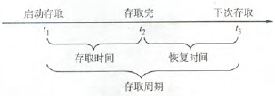
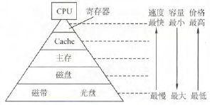
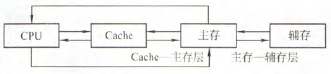
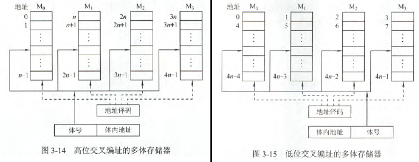
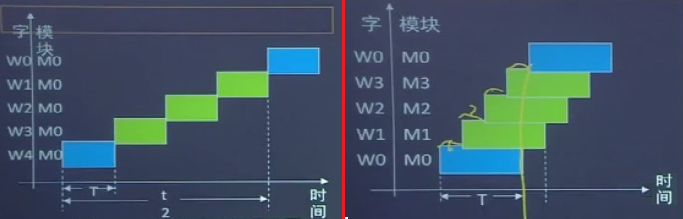
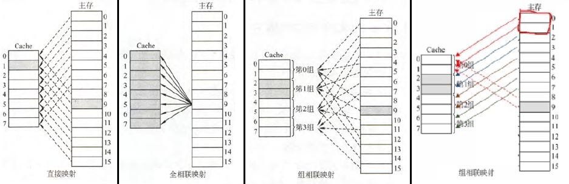
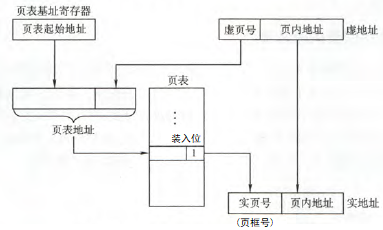
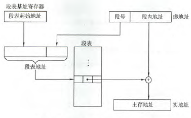

## 存储系统 <!-- {docsify-ignore} -->

### 存储器的分类

- **存储器的分类**
    - 按作用分：**主存（内存）**、**辅存（外存）**、**高速缓存存储器（Cache）**
    - 按介质分：磁表面（磁盘、磁带）、磁芯、半导体、光（光盘）
    - 按存取方式分
        - **随机存取**
            1. **随机存取存储器（RAM）**
                1. **静态RAM（SRAM）**
                2. **动态RAM（DRAM）**
            2. **只读存储器（ROM）**：**广义上包含“可擦除”**（EPROM、EEPROM）
        - **串行访问存储器**
            1. **顺序存取存储器（SAM）**：如磁带
            2. **直接存取存储器（DAM）**：如磁盘、光盘，先找到小区域（磁道），再顺序查找
        - **相联存储器**：**可以按内容寻址**，也可以按地址寻址
    - 按（断电后）信息可保存性分：**易失性**存储器、非易失性存储器
- **破坏性读出**：读出后原信息将被破坏
- 操作系统保存在硬盘上，需要固化于ROM的引导程序，引导到主存RAM中
- **存储器的性能指标**
    1. **存储容量 = 存储字数 × 字长**
    2. 存储速度
        1. **数据传输率（带宽） = 数据宽度 / 存储周期**
        2. **存取周期 = 存取时间 + 恢复时间**
        - 
    3. 单位成本

### 存储器的层次化结构

1. **Cache——主存**
    1. 解决CPU和主存速度不匹配
    2. 硬件完成数据调动，对程序员透明
2. **主存——辅存**
    1. 解决存储容量问题
    2. 硬件和操作系统完成数据调用，对应用程序员透明
- **分层意义**：解决速度、容量、成本的矛盾
- 
- 

### 半导体随机存储器

- **RAM**
    - **SRAM与DRAM**
        |    特点    |     SRAM     |   DRAM   |
        | :--------: | :----------: | :------: |
        |    介质    | 双稳态触发器 | 栅极电容 |
        |   易失性   |      是      |    是    |
        | 破坏性读出 |      否      |    是    |
        |  需要刷新  |      否      |    是    |
        |  地址复用  |      无      |    有    |
        |   集成度   |      低      |    高    |
        |    用途    |    Cache     |   主存   |

    - **DRAM的刷新**
        - **刷新周期**：通常为2ms
        - **死区**：刷新周期内，*连续*不能进行读写操作的时间
        - **死时间率 = 死区 / 刷新周期**
        - **刷新方式**
            1. **集中刷新**
                1. [WR WR ... WR] [REF1 REF2 ... REFn]
                2. 固定一段时间刷新
                3. 存取速度高，但死区长。
            2. **分散刷新**
                1. [WR REF1] [WR REF2] ... [WR REFn]
                2. 每存取周期后，都刷新其中一行
                3. 无死区（因为存取周期包括刷新），但存取周期长
            3. **异步刷新**
                1. [WR WR ... WR REF1] [WR WR ... WR REF2] ...  [WR WR ... WR REFn]
                2. 每隔$\lfloor \frac{刷新周期}{行数} \rfloor$产生一次刷新请求，刷新其中一行
                3. 死区短，且充分利用刷新周期
            4. ***透明刷新***：刷新安排在不需要存取的译码阶段
        - **特点**
            1. 刷新对CPU透明
            2. 刷新单位是**行**
            3. 刷新类似读，但不需要信息输出和片选
- **ROM**
    1. 掩膜式ROM（MROM）：生产时写入，不可改写
    2. 一次可编程ROM（PROM）：用户写入，不可改写
    3. 可擦除可编程ROM（EPROM）：有限次改写，写入时间长
        1. 紫外线擦除（UVEPROM）
        2. 电擦除（E2PROM）
    4. 闪存（Flash）：快速改写，本质是E2PROM
    5. 固态硬盘（SSD）：由Flash芯片组成
    - ROM写入须先擦除，故**写比读慢**

### 主存与CPU的连接

- 主存通过**数据总线**、**地址总线**、**控制总线**与CPU连接
- **主存容量扩展**
    1. **位扩展**：扩展位数
        - 芯片连接地址线方式相同、数据线方式不同
    2. **字扩展**：扩展字数
        - 芯片连接地址线方式相同、数据线方式相同
        - CPU高位地址通过线选/译码器片选控制芯片
            - **线选法**：高位地址直连各芯片片选。空间不连续，浪费地址资源。
            - **译码片选法**
    3. **字位同时扩展**
    
    !> 无论如何扩展，芯片连接地址线方式都相同

### 双端口RAM和多模块存储器

- **双端口RAM**
    - 有两个独立端口，分别有独立的地址/数据/控制线，允许同时异步访问
    - 属于**空间并行**技术
    - **冲突**
        - **发生情况**：同时操作，且至少一个为写
        - **解决**：置$\overline{\mathrm{Busy}}=0$，延迟其中一个端口访问
- **多模块存储器**
    - 属于**时间并行**技术
    - **分类**
        - **单体多字存储器**
            - 单个存储体，每存储单元存m个字。每存取周期**并行读这m个字**
            - 缺点：指令和数据在主存中必须**连续存放**
        - **多体并行存储器**
            - 有多个模块，有独立的控制电路、MAR、MDR。既能并行工作，又能交叉工作。模块每个字的存取周期为$T$，总线传送周期为$r$
            - **工作方式**
                - **高位交叉编址（顺序方式）**
                    1. 存储器：顺序存储器
                    2. 连续存$n$个字耗时：$nT$
                - **低位交叉编址（交叉方式）**
                    1. 存储器：交叉存储器
                    2. 模块数应 ≥ **交叉存取度**$m=T/r$
                    3. 连续存$n$个字耗时：$T+(n-1)r$
                    4. 符合**程序局部性原理**
        - 意义：提高CPU访存速度
    - 
    - 

### Cache

- **程序访问的局部性原理（Cache加速的原理）**
    - **时间局部性**：不久后，很可能会再用到当前信息（数据/指令）
    - **空间局部性**：不久后，很可能会再用到当前信息的邻近存储空间信息（数据/指令）
- **Cache的工作原理**
    - Cache和主存分成大小都为**块长**的块
    - 交换数据时，CPU-Cache以**字**为单位，Cache-主存以**块**为单位
    - **读策略**
        ```
        CPU读请求⇒
            Cache未命中⇒
                Cache不满⇒
                    把主存此字所在块调入Cache
                else
                    调用替换算法，该块替换某Cache块
            读Cache
        ```

        !> 有时也同时访问Cache和主存，命中再终止主存访问

    - **性能指标**
        1. **Cache命中率**：$H=\frac{N_c}{N_c+N_m}$
        2. **平均访问时间**：$T_a=Ht_c+(1-H)t_m$
        3. **Cache效率**：$e =\frac{t_c}{T_a}$
- **地址映射**（Cache和主存的映射）
    - **映射方式**
        1. **直接映射**
            - 主存的某块只能装入Cache的**唯一位置**。冲突直接替换，**无须替换算法**
            - 映射关系：$j=i\bmod 2^c$。Cache块号$j$，主存块号$i$，Cache块数$2^c$
            - 优缺点和全相联映射相反
            - **主存地址结构：主存块标记 | Cache块号 | 块内地址**
        2. **全相联映射**
            - 主存的某块可以装入Cache的**任何位置**
            - 优点：灵活，冲突概率低，空间利用率、命中率高
            - 缺点：地址变换慢，实现成本高，通常要用**相联存储器**
            - **主存地址结构：主存块标记 | 块内地址**
        3. **组相连映射**
            - Cache分组，**组间直接映射，组内全相联映射**
            - 映射关系：$j=i \bmod Q$。Cache组号$j$，主存块号$i$，Cache组数$Q$
            - **主存地址结构：主存块标记 | 组号 | 块内地址**
        
        !> 有些教材组相连映射关系是$j=(i \bmod 2^c) / \frac{2^c}{Q}$，统考出现过

        - 
    - **主存地址结构成分长度计算**
        - **主存块标记位数 = 主存容量位数 - Cache块(组)号位数 - 块内地址位数**
        - **Cche块号位数 =  Cache容量位数 - 块长位数**
        - **Cache组号位数**
        - **块内地址位数 = 块长位数**
    - **Cache*总*容量计算**
        - 标记项 = **有效位(1位)** + 一致性维护位(脏位) + 替换算法位 + **主存块标记位**
        - **脏位**在写回法时才考虑，1位
        - **替换算法位**在给出替换算法时才考虑，如$2^c$路组相联+LRU需要$c$位
        - **总容量 = Cache块数 × (1 + 主存块标记长 + 块长)**
        
        !> Cache总容量包括标记项，而Cache容量不包括

- **Cache中主存块的替换算法**
    1. **随机算法RAND**：随机替换
    2. **先进先出算法FIFO**：替换最早调入的行（调入时间）（双链+hash实现）
    3. **近期最少使用算法LRU**：替换上次命中最久远的行（命中时间）（双链+hash实现）
    4. **最不经常使用算法LFU**：替换命中次数最少的行（命中频次）（堆+hash实现）
    
    !> 只有LRU依据程序局部性原理

-  **Cache写策略**
    - **写命中**
        - **全写法**
            - 命中时，同时写入Cache和主存
            - 缺点：增加访存次数
            - 速度不匹配→加一个FIFO队列**写缓冲**
        - **写回法**
            - 命中时，只写入Cache；块替换才写回主存
            - 缺点：存在不一致隐患
            - 需要设**脏位**反映该块修改与否
    - **写不命中**
        - **写分配法**
            - 加载到Cache中再更新
            - 利用了程序空间局部性
            - 一般搭配写回法（尽量操作Cache）
        - **非写分配法**
            - 直接更新主存
            - 一般搭配全写法（尽量操作主存）
- **Cache的改进**
    - **两级Cache**：$\mathrm{CPU} \longleftrightarrow \mathrm{L1Cache(片内)} \overset{全写}{\longleftrightarrow} \mathrm{L2Cache(片外)} 
 \overset{写回}{\longleftrightarrow} \mathrm{主存}$
    - **分立Cache**
        - 指令和数据分离存在两个Cache中，主存中指令和数据也要分开存。相对于**统一Cache**
        - 目的：**减少指令流水线资源冲突**

### 虚拟存储器

- **基本概念**
    - **虚地址（逻辑地址）** → **虚拟空间（程序空间）**
    - **实地址（物理地址）** → **主存空间（实地址空间）**
    - **页表/段表**：实现虚→实地址变换
    - **页表/段表基址寄存器**：存放当前程序的页表/段表起始地址
    - **装入位**：当前页/段是否已装入主存
- **页式虚存**
    - 固定长度的**页**为单位
    - **页面大小设置**
        - 页面太小 ⇒ 页表大，不能充分利用程序空间局部性
        - 页面太大 ⇒ 页面调动时间长
    - 优点：简单方便
    - 缺点：尾页零头浪费
    - 
- **段式虚存**
    - **不**固定长度的**段**为单位
    - 段表记录信息包括段起点和**段长**
    - 优点：段分界与程序自然分界对应，具有**逻辑独立性**
    - 缺点：段间碎片浪费
    - 
- **段页式虚存**
    - 把程序按逻辑结构分段，每段再分页，数据调动以页为单位
    - 每个程序对应一个段表，每段对应一个页表。段长是页长整倍、段起点是某页起点
    - 优点：兼具段页优点
    - 缺点：两次查表，开销大
- **快表TLB**
    - **快表（TLB）**是**慢表（Page）** （即完整的页表）的一个小副本，存于Cache中
    - TLB一般用**相联存储器**
    - 几个命题
        - TLB命中⇒Page命中
        - Cache命中⇒Page命中
        - Page不命中⇒TLB和Cache都不命中（逆否）
        
        !> Page命中=页在主存中，而Cache又是主存小副本，所以……

- **虚存和Cache的异同**
    - 相同：用程序局部性原理，提高系统性能
    - 不同
        |      方面      |     Cache      |      虚存      |
        | :------------: | :------------: | :------------: |
        |    解决问题    |    系统速度    |    主存容量    |
        |     透明性     | 所有程序员透明 | 应用程序员透明 |
        | 不命中性能影响 |      较小      |      较大      |
        |     写策略     |   直写/回写    | 回写（直写慢） |

    !> **透明性**是指“看不到”
