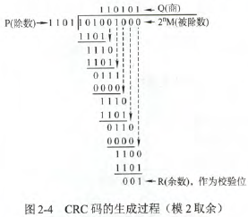
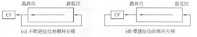
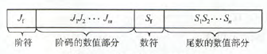
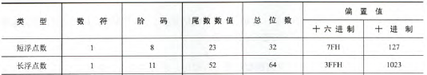

## 数据的表示和运算 <!-- {docsify-ignore} -->

### 数制与编码

- **数制转换**
    1. **二转八/十六**：小数点左右每三/四位划一组
    2. **任意转十**：按权展开相加
    3. **十转任意**：整数部分除基倒序取余，小数部分乘基正序取整
- **真值和机器数**
    - **真值**：带符号的数
    - **机器数**：符号“数字化”的数
- **BCD码**
    - **8421码**：$D=8b_3+4b_2+2b_1+b_0$
        - 大于$(1001)_2$时加$(0110)_2$修正
    - **余3码**：8421码每个编码加3
- **字符与字符串**
    - **ASCII码**：7位二进制
        - '0' = $(011\ 0000)_2$
        - 'A' = $(100\ 0001)_2$
        - 'a' = $(110\ 0001)_2$
    - **汉字编码**：区位码、国标码、汉字内码
- **数据存储方式**
    - **大/小端模式**
        - **大端模式**：（低地址）先存高位字节
        - **小端模式**：（低地址）先存低位字节
    - **边界对齐方式**
        - **按边界对齐**：数据地址是数据长度的整倍
        - **不按边界对齐**：连续存放数据

        !> c语言还要求struct结构体长度是最大成员长度的整倍

- **校验码**
    - **原理**：增加冗余码来检验或纠错
    - **码距**：任意两个合法码字之间最少变化的位数
        - 码距≥2才具备检错能力
    - **纠错理论**：$L-1=D+C$ 且$D\geq C$
        - 码距$L$越大，检错位数$D$和纠错位数$C$越大
        - 推论：能检错$L-1$位，或纠错$\lfloor \frac{L-1}{2} \rfloor$位
    - **几种校验码**
        - **奇/偶校验码**：“1”个数为奇/偶。不能纠错
        - **海明校验码**
            - 规定符号：信息位$D_i$，校验位$P_i$，海明码$H_i$，$i=1,2,\cdots$
            - **生成步骤**
                1. 确定位数：$n+k\leq 2^k–1$（$n$为有效信息的位数，$k$为校验位的位数）
                2. 确定校验位：$P_i=H_{2^{i-1}}=\bigoplus\limits_{j_{i-1}=1} H_j$。每个校验位都对应一组偶校验
                3. 剩余的按顺序填充信息位
            - **校验与纠错**：$C_i=\bigoplus\limits_{j_{i-1}=1} H_j$。若$C=0$则正确，否则$H_C$为出错位置
            - 若要检测两位错，需再增加一位奇偶校验位，即$k+1$位，但对两位错只能检测不能纠正
            - 例：
                |   H   |  $H_7$  |  $H_6$  | $H_5$ | $H_4$ |  $H_3$  |  $H_2$  | $H_1$ |
                | :---: | :-----: | :-----: | :---: | :---: | :-----: | :-----: | :---: |
                | 下标  | 1**1**1 | 1**1**0 |  101  |  100  | 0**1**1 | 0**1**0 |  001  |
                |  D/P  |  $D_4$  |  $D_3$  | $D_2$ | $P_3$ |  $D_1$  |  $P_2$  | $P_1$ |
                |  值   |  **1**  |  **0**  |   1   | $P_3$ |  **1**  |  $P_2$  | $P_1$ |

                $P_2=H_3\bigoplus H_6\bigoplus H_7=1\bigoplus 0\bigoplus 1=0$
    - **循环冗余校验码CRC**
        - **模2除法**：列竖式，商取高位同或，减法为异或
        - **生成步骤**
            1. 将K位信息码左移R位，其中R为**生成多项式最高次幂**
            2. K+R位信息码对生成多项式做**模2除法**，取余得R位校验码，代替信息码末R位
        - **校验与纠错**：对生成多项式做模2除法，余0正确。检错和纠错能力取决于生成多项式
        - **适用场景**：大量数据传送
        - **生成多项式**的要求：
            1. 最高和最低位为1
            2. 出错时，校验码不为0
            3. 不同位出错时余数不同
        - 

### 定点数的表示与运算

- **定点数的表示**
    - **无符号数**
    - **有符号数**
        - **原码、反码、补码**
            | 表示  | +\|x\| |       -\|x\|       | 零有几种表示 |
            | :---: | :----: | :----------------: | :----------: |
            | 原码  | \|x\|  |   符号位1接\|x\|   |      2       |
            | 反码  | \|x\|  |     \|x\|取反      |      2       |
            | 补码  | \|x\|  | \|x\|取反，末位加1 |      1       |

        !> 小数取反必须先补全末尾0
            
        - **移码**
            - 仅表**整数**
            - 在真值上加偏移，通常为$2^n$，即**补码符号位取反**
            - **0的表示唯一**
            - **移码越大，真值越大**
- **定点数的运算**
    - **算术移位**
        |      表示      |          补位          |
        | :------------: | :--------------------: |
        | 正（原/反/补） |      左/右侧无穷0      |
        |      负原      |      左/右侧无穷0      |
        |      负补      | *左侧无穷1，右侧无穷0* |
        |      负反      |      左/右侧无穷1      |

    !> 算术移位符号位皆不变

    - **逻辑移位**：看作无符号数，移位需要丢位，皆补0
    - **循环移位**
        - 
    - **原码加减**
    - **补码加减**：加相当于无符号数加；减相当于与被减数相反数加。丢掉溢出
    - **符号扩展**：补充类似算术移位，符号位也不变
    - **溢出判断**
        - **一位符号位**：$V = A_S B_S \overline{S_S} + \overline{A_S} \overline{B_S} S_S$
        - **双符号位（模四补码）**：$V = S_{S1} \bigoplus S_{S2}$。01正溢，10负溢
        - **一位符号位根据进位情况**：$V = C_S \bigoplus C_1$
    - **定点数乘除**
        - **C=A×B**
            - **原码一位乘**
                ```
                A、C双符号位，符号单独算
                从B最低位开始枚举没一位:
                    遇1⇒C=C+A
                    C原码右移
                ```

            - **补码一位乘（Booth）**
                ```
                A、C双符号位，符号一起算
                B后添0
                从B最低位枚举每两位（重叠，不取最后一次）:
                    遇01⇒C=C+A
                    遇10⇒C=C+(-A)
                    C补码右移（最后一次不移）
                ```

        - **C=A/B**
            - **原码一位除（不恢复余数）**
                ```
                符号单独算
                A=A+(-B)
                循环n次:
                    A正⇒商1、移位、A=A+(-B)
                    A负⇒商0、移位、A=A+B
                    （移位为A和C都原码左移）
                A正⇒商1
                A负⇒商0、A=A+B
                ```

            - **补码一位除（加减交替）**：
                ```
                A、C双符号位，符号一起算
                A、B同号⇒A=A+(-B)
                A、B异号⇒A=A+B
                循环：
                    A、B同号⇒商1、移位、A=A+(-B)
                    A、B异号⇒商0、移位、A=A+B
                    （移位为A和C都补码左移）
                C末位恒置1
                ```

        !> 原码乘除可类比十进制方法计算

    - **强制类型转换（C语言）**：大转小高位截断，小转大数值相等
        |   类型    | 字节  |  类型  | 字节  |
        | :-------: | :---: | :----: | :---: |
        |   char    |   1   | float  |   4   |
        |   short   |   2   | double |   8   |
        |    int    |  2/4  |
        |   long    |   4   |
        | long long |   8   |

### 浮点数的表示与运算

- **浮点数的表示**
    - 
    - **规格化**
        - **操作**
            - **左规**：尾数算术左移，阶码减一
            - **右规**：尾数算术右移，阶码加一
        - **目标**：绝对值$\in [1/2,1]$
        - **形式**
            - **原码**：0.1……/1.1……
            - **补码**：0.1……/1.0……

            !> 基数变化时，“1”指不全为0

    - **IEEE 754**
        - **阶码是移码，尾数是原码**
        - **尾数隐含整数1**
        - **短浮点数阶码1~254**
            - 0表非规格化。此时无隐含1，且阶码相当于1
            - 255表无穷大
        - 
- **浮点数的加减运算**
    1. **对阶**：小阶靠大阶
    2. **尾数求和**
    3. **规格化**
        1. **左规**：尾数（补码）0.0……/1.1……时
        2. **右规**：溢出时（最多一次）
    4. **舍入**
        1. 发生于**对阶**和**右规**
        2. **方法**：**0舍1入**/**恒置1**
    5. **溢出判断**：看阶码。有(正/负)(上/下)溢
    
    !> IEEE 754不能直接这样加，注意规格化时考虑隐含1

### 算术逻辑单元ALU

- **ALU**是**组合逻辑电路**（**没有暂存功能**）
- **功能**：执行**算术运算**（本质是加法，并行加法器）和**逻辑运算**
- **加法器**
    - **一位全加器**
        - **和表达式**：$S_i=A_i\bigoplus B_i\bigoplus C_{i-1}$
        - **进位表达式**：$C_i=A_i B_i+(A_i \bigoplus B_i)C_{i-1}$
    - **串行加法器**：只有一个全加器
    - **并行加法器**：多个全加器
        - **进位产生函数**：$G_i=A_i B_i$
        - **进位传递函数**：$P_i=A_i \bigoplus B_i$
        - **进位表达式**：$C_i=G_i+P_i C_{i-1}$
        - **进位传递决定运算时间**
        - **进位方式**
            - **串行进位**
            - **并行进位**
                - 一般并行进位
                - 分组并行进位
                    - 单级先行进位（组内并、组间串）（n × CLA）
                    - 多级先行进位（组内串、组间并）（n × BCLA + CLA）