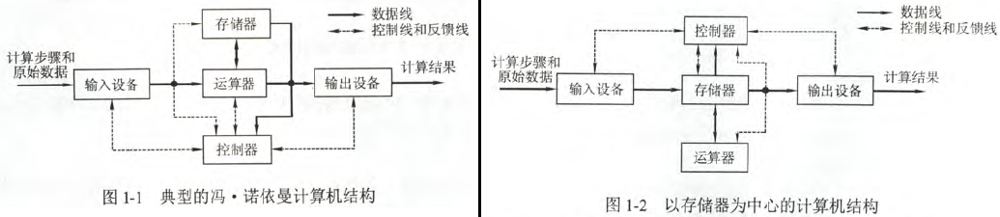
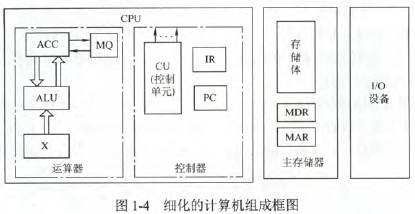

# 计算机系统概述

## 计算机发展历程

- **计算机四代**：电子管 → 晶体管 → 中小规模集成电路 → 超大规模集成电路
- **摩尔定律**：价格不变时，每18个月晶体管数目和性能翻一倍

## 计算机系统层次结构

- **计算机系统的组成**
    - **硬件系统 + 软件系统 = 计算机系统**
    - 许多功能用软件或硬件都可实现，**软硬件在逻辑上是等效的**
    - 硬件实现更快，软件实现更灵活
    - 几个概念
        - **系列机**：基本指令系统相同的不同型号计算机
        - **固件**：将程序固定在ROM中。介于硬件和软件之间
        - **软件可移植性**：软件稍作修改就能在不同系列机中迁移的可能性
        - **兼容**：软/硬件通用性，通常在同一系列机中。一般**向后兼容**
- **冯诺依曼机特点**
    1. 由**存储器、运算器、控制器、输入和输出设备**五部分组成
        - **中央处理器CPU**：集成运算器和控制器。现代CPU还包括MAR和MDR
    2. 采用**存储程序**思想，指令和数据以同等地位存于存储器，可按地址寻访
        - **存储程序**：将指令以代码形式事先输入到主存，然后按其在存储器的首地址执行程序的第一条指令，再按程序规定顺序执行其他指令，直至程序结束 
    3. 指令和数据用**二进制**表示
    4. 指令由**操作码**和**地址码**组成
    5. 指令在存储器内按顺序存放，通常**顺序执行指令**
    6. **早期**以**运算器为中心**，I/O设备与存储器间的数据传送都通过运算器；**现代**以**存储器为中心**，I/O设备可直接与存储器相连
    7. **控制流驱动**方式。**单指令流单数据流**
    - 
    - 
- **计算机软件的分类**
    - **系统软件**：管理整个计算机系统
        - 如：操作系统（OS）、数据库管理系统（DBMS）、语言处理程序、分布式软件系统、网络软件系统、标准库程序、服务性程序等
    - **应用软件**：按任务需要编制成的各种程序
- **计算机语言**
    - $\mathrm{高级语言} \overset{编译}{\longrightarrow} \mathrm{汇编语言} 
 \overset{汇编}{\longrightarrow} \mathrm{机器语言}$
    - 三个“程序”
        1. **编译程序**：高级→机器。生成目标程序
        2. **解释程序**：高级→机器。不生成目标程序，边翻译边执行
        3. **汇编程序**：汇编→机器
        - 解释程序比编译程序编译快，但运行慢

## 计算机的性能指标

- **几个“字长”**
    1. **机器字长**：一次整数**运算**所能处理的位数
        - 一般为**内部寄存器**和**数据总线**位数
        - 一般取存储字长整数倍
        - **XX位CPU**、**XX位计算机**都指机器字长
    2. **存储字长**：存储单元的存储位数。即MDR位数。字节的整数倍
    3. **指令字长**：指令字的位数
    4. **数据通路带宽**：**外部**数据总线一次并行传送信息的位数
- **主存容量**：**字数×字长**。如512K×16位
- **运算速度**
    1. **吞吐量**：单位时间内系统处理请求数量。取决于主存存取周期
    2. **响应时间**：从发送请求到响应得到结果的耗时
    3. **CPU时钟周期**：1/主频，最基本的时间单位。≠CPU周期（机器周期）
    4. **主频**：CPU时钟频率，即每秒多少个时钟周期
    5. **CPI**：执行一条指令所需时钟周期数
    6. **CPU执行时间**：程序花费时间
        - **= 指令条数 × CPI / 主频**
    7. **MIPS**：每秒执行几百万条指令
        - **= 指令条数 / CPU执行时间 / 10^6**
        - **= 主频 / CPI / 10^6**
    8. **MFLOPS**：每秒执行几百万次浮点运算
        - **MFLOPS = 浮点运算次数 / 执行时间 / 10^6**
        - 还有GFLOPS、TFLOPS、PFLOPS
