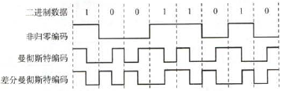
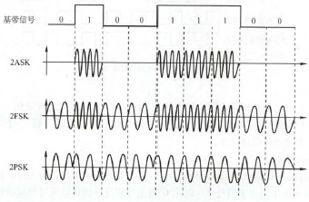
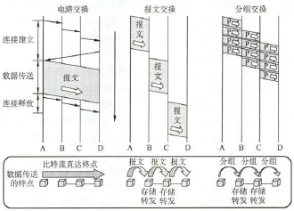

# 物理层

## 通信基础

- **概念**
    - **数据**：传送信息的实体
    - **信号**：数据的存在形式
    - **码元**：用固定时长（**码元宽度**）的信号波形表示一位k进制数字
    - **码元传输速率（波特率）**：每秒传输的码元数，单位Baud
    - **信息传输速率（比特率）**：每秒传输的比特数，单位b/s
    - **通信系统组成**：**信源**、 **信道**、**信宿**
    - **通信交互方式**
        |    方式    | 方向  | 同时收发 | 信道数 |
        | :--------: | :---: | :------: | :----: |
        |  **单工**  | 单向  |    -     |   1    |
        | **半双工** | 双向  |    ×     |   2    |
        | **全双工** | 双向  |    √     |   2    |

- **奈奎斯特定理**：理想低通信道（**没有噪声，有限带宽**）中 **极限波特率=$2W \text{ Baud}$** ，其中W为低通信道带宽（单位Hz）
    - 波特率有上限，且频带越宽，波特率上限越高
    - 未对比特率给出限制
- **香农定理**：**高斯白噪声、有限带宽**的信道中 **极限比特率=$W\log_{2}(1+S/N)$** ，其中W为信道带宽，S/N为信噪比（平均功率比，单位dB对应**10·lg(~)** ）
    - 比特率有上限，且频带越宽或信噪比越大，比特率上限越高
    - 在极限比特率以内，总能找到无差错传输的办法
    - 实际比特率一般比该极限低得多
- **编码与调制**：**编码**是数据 → 数字信号，**调制**是数据 → 模拟信号
    - **数字数据 → 数字信号**
        - **场景**：主要用于基带传输
        - **方式**
            - 
            - **非归零编码NRZ**：易实现；无检错、难同步
            - **曼彻斯特编码**：位中间的跳变既作为同步的时钟信号，又作为数据信号；但带宽是基带带宽两倍。用于**以太网**
            - **差分曼彻斯特编码**：自同步、抗干扰
            - 4B/5B编码
    - **数字数据 → 模拟信号**
        - **场景**：调制解调器
        - **方式**：ASK、FSK、PSK、QAM
            - 
    - **模拟数据 → 数字信号**
        - **场景**：脉码调制PCM（对音频信号编码）
        - **步骤**：**采样 → 量化 → 编码**
        - **采样定理**（奈奎斯特定理）：$f_{采样}\geq 2f_{max}$，才能保证数字信号能完整保留模拟信号的信息
    - **模拟数据 → 模拟信号**
        - **场景**：电话机和本地电话交换局
        - 可使用**频分复用FDM**充分利用带宽
- **交换**：动态分配传输线路
    - 
    - **电路交换**（有连接）
        - **阶段**：**连接建立 → 数据传输 → 连接释放**
        - **交换结点**：**直通方式**，不存在存储转发耗时
        - **场景**：**传输大量数据**
        - 传输过程中，用户始终占用端到端的固定传输带宽
    - **报文交换**（无连接）
        - **交换单位**：**报文**（携带原地址、目的地址等信息）
        - **交换结点**：**存储转发方式**
        - **场景**：电报。*已被分组交换取代*
    - **分组交换**（无连接）
        - **交换单位**：数据划分成小数据块，加上控制信息构成**分组（packet）**，从而解决大报文传输问题
        - **交换结点**：**存储转发方式**
        - **场景**：计算机之间的**突发式数据通信**，或端到端通路由多段链路组成
        - **方式**
            - **数据报**
                - 结点根据**转发表**转发分组，由于不同时刻转发表可能不同，传输路径也可能不同
                - **特点**：无连接。未必可靠，未必按序到达；故障适应好
            - **虚电路**：
                - 每次传输选择一个未用过的虚电路号，建立**双向**的虚电路，一旦建立就固定路径
                - **阶段**：**虚电路建立 → 数据传输 → 虚电路释放**
                - **特点**：和数据报相反

## 传输介质

- **传输介质**：双绞线、同轴电缆、光纤、无线传输介质（无线电波、微波、红外线、激光）
- **物理层接口的特性**
    - **机械特性**：物理规格、引线数、引脚排布等
    - **电气特性**：电压高低、阻抗匹配、传输速率、距离限制等
    - **功能特性**：电平的意义、信号线的用途等
    - **规程特性**：物理线路的工作规程与时序

## 物理层设备

- **中继器（转发器）**：单进单出，将信号整形、放大、转发

!> 原理是信号再生，而不是像放大器一样单纯放大

- **集线器Hub**：多端口的中继器。任一端口接收，则整形、放大、转发所有端口。半双工
