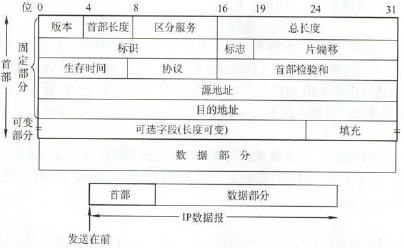
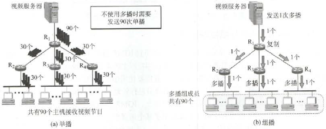
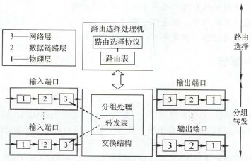

## 网络层（未完） <!-- {docsify-ignore} -->

### 网络层的功能

- **异构网络互联**
    - **中继系统**：连接多个网络
        - **物理层**：中继器、集线器
        - **数据链路层**：网桥、交换机
        - **网络层**：路由器
        - **网络层以上**：网关
        
        !> 只有路由器实现互联，前面两层都只是扩大

    - **互联网（虚拟IP网络）**：使用IP协议的多个网络互联，逻辑上看就好像同一网络
- **路由选择与分组转发**（路由器功能）
    
!> **路由表** ≈ 转发表

- **拥塞控制**
    - **方法**：开环控制（静态）、闭环控制（动态）

### 路由算法（TODO）

- **本质**：最短路算法
- **分类**
    - **静态路由（非自适应）**：网管手动配置路由信息
    - **动态路由（自适应）**：算法动态配置路由信息
        - **距离-向量路由算法**：定期更新相邻结点的路由表，它记录三个关键数据 <目的网络, 距离, 下一跳路由> 。典型算法是RIP
            - RIP基于**跳数**，即路径的路由数。跳数=16表示不可达
        - **链路状态路由算法**：检查所有链路状态，并发送给所有结点，链路变化时Dijkstra更新。典型算法是OSPF
- **层次路由**
    - **内部网关协议IGP**：RIP（基于UDP）、OSPF（基于IP）
    - **外部网关协议EGP**：BGP（基于TCP）

### IPv4

- **IPv4分组**
    - **数据报格式**
        - 
        
        ?> 不用记结构

        - **版本**：4位，协议版本，4
        - **首部长度**：4位，**以4B为单位**。最长60B（4B×15），最短也是最常用为20B（固定部分）
        - **总长度**：16位，**以B为单位**。最长65535B，封装成帧时最长为MTU值（1500B）
        - **标识**：16位。每产生一个数据报就加1。分片的各数据报片标识相同
        
        !> 不是序号，因为IP无连接

        - **标志**：3位
            - **MF**：最低位，MF=1表后面还有分片
            - **DF**：中间位，DF=0表允许分片
        - **片偏移**：13位，**以8B为单位**，分片相对于原分组的数据偏移，即**分片数据长度除最后一片外必须是8B整数倍**
        - **首部校验和**：16位。只校验首部
        - **生存时间TTL**：8位。可通过路由器数的最大值。路由器转发前须先减1，减至0则丢弃
        - **协议**：8位。TCP为6，UDP为17
        - **源地址**：4B。发送方IP地址
        - **目的地址**：4B。接收方IP地址
    - **分片**：数据报长度超过MTU时，分装成多个较小的**片**
        - **最大传送单元MTU**：数据链路层数据报能承受的最大数据量。以太网为1500B
        - **重组**：依据标识、标志、片偏移
    - **转发分组流程**：目的主机IP地址→网络地址。按直接相连、特定主机路由（测试用）、到达网络地址的路由、默认路由4个优先级交付
- **两级IP**
    - **IP地址 = 网络号 + 主机号**
    - **分类**
        |                    |    A类     |    B类     |     C类     |
        | :----------------: | :--------: | :--------: | :---------: |
        |  **第一个网络号**  |     1      |   128.1    |   192.0.1   |
        | **最后一个网络号** |    126     |  191.255   | 223.255.255 |
        |    **比特前缀**    |     0      |     10     |     110     |
        |   **最大主机数**   | $2^{24}-2$ | $2^{16}-2$ |  $2^{8}-2$  |

        - **D类**：多播地址，224 - 239
        - **E类**：保留，240 - 255
        - **特殊IP**
            - **主机号全0**：本网络
            - **32位全0**：本网络的本主机
            - **主机号全1**：本网络的广播地址（**直接广播地址**）
            - **32位全1**：整个TCP/IP网络的广播地址（**受限广播地址**）
            - **127.0.0.1**：**环路自检地址**，表任何主机本身
            
            !> 实际中，直接广播地址=受限广播地址
            
- **网络地址转换NAT**:将专用网络地址转换为公用地址
    - **私有IP**（只用于LAN）
        - **A类**：10
        - **B类**：172.16 - 172.31
        - **C类**：192.168.0 - 192.168.255
    - **NAT转换表**：映射 {本地IP: 端口} → {全球IP: 端口}
    - 转发IP数据报时，普通路由器不改变源目IP，而NAT路由器改变
- **子网划分**
    - **IP地址 = 网络号 + 子网号 + 主机号**
        - 网络号和二级IP一样，只是把二级IP主机号再拆分
    - **子网掩码**：子网掩码 AND IP地址 = 子网网络地址
        - **默认子网掩码**：未划分子网。A类255.0.0.0，B类255.255.0.0，C类255.255.255.0
- **CIDR（无分类域间路由选择）**：合并网络号和子网号为**网络前缀**
    - **IP地址 = 网络前缀 + 主机号**
    - **斜线记法**：**IP地址/网络前缀比特数**
    - 没有IP分类和子网概念，但仍有掩码概念，且还可以继续划分网络
    - **CIDR地址块**：网络前缀相同的连续IP地址
    - **路由聚合（超网）**：路由表记录网络前缀而不是传统的网络地址，使一个项可以表示原本多个路由
    - **最长前缀匹配**：当按网络前缀匹配到路由表不止一项时，选前缀最长的一项，因为前缀越长网络越具体
- **ARP、DHCP、ICMP**
    - **地址解析协议ARP**：完成IP地址到MAC地址映射
        - **工作层**：**网络层**
        - **ARP表**：存放本局域网各主机/路由器的IP地址到MAC地址的映射。每个主机都有一张
        - **流程**：先查ARP表有没有目的IP地址
            - 有则将MAC地址写入帧发送
            - 没有则广播ARP请求（MAC地址全1），响应后再发帧
            - 若不在同一网络，则通过ARP表找到本网络某路由MAC地址，把数据报发给它处理
    - **动态主机配置协议DHCP**：给主机动态分配IP地址
        - **工作层**：**应用层**，**基于UDP**
        - **流程**：使用**C/S方式**。主机广播**DHCP发现**，DHCP服务器广播**DHCP提供**，主机广播**DHCP请求**，DHCP服务器广播**DHCP确认**
        - 分配的IP是临时的，有**租用期**
    - **网际控制报文协议ICMP**：让主机/路由器报告差错和异常
        - **工作层**：**网络层**
        - **ICMP报文**：作为IP分组的数据部分。有两种
            - **ICMP差错报告**：目标主机或路由器向源主机报告差错和异常
                - **类型**：终点不可达、源点抑制、时间超过、参数问题、路由重定向
            - **ICMP询问**
                - **类型**：回送请求/回答、时间戳请求/回答、掩码地址请求/回答、路由器询问/通告
                - **应用**：ping和traceroute（Windows为tracert）

### IPv6

- **IPv6的特点**
    - 增大地址空间
    - 与IPv4不兼容，但总体与其他因特网协议兼容
- **IPv6目的地址类型**
    - **单播**：单个主机
    - **多播（组播）**：一组主机
    - **任播**：一组主机，但只交付其中一台，一般最近一台。IPv6新增类型
- **过渡策略**
    - 双协议栈：装两个协议栈进行转换
    - 隧道技术：IPv6数据报封装成IPv4数据报的数据部分

### 路由协议（同“路由算法”）

### IP组播

- 
- 仅用于无连接的UDP
- **协议**：**因特网组管理协议IGMP**
- **IP组播地址**：D类地址

### 移动IP（TODO）

- **概念**
- **通信过程**

### 网络层设备

- **路由器（网关）**：连接异构网络并路由转发的多端口专用计算机
    - 源目同网则直接交付，不经路由；否则间接交付，通过路由按转发表转发到下一路由
    - **所在层**：**网络层**，但是实现了物理层、数据链路层、网络层
    - **组成**
        - 
    - **功能**：**路由计算**和**分组转发**
    - **路由表**
        - **表项**：目的网络IP地址、子网掩码、下一跳IP地址、接口
