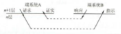
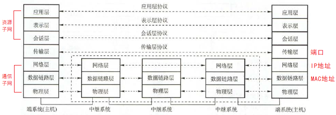
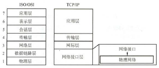
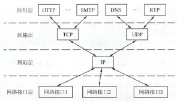

## 计算机网络体系结构 <!-- {docsify-ignore} -->

### 计算机网络概述

- **定义**（三种）：远程信息处理 → 网络协议、资源共享 → 用户透明性
- **组成**
    - **边缘部分**：用户直接使用的主机（**端系统**）
    - **核心部分**：大量网络和连接它们的路由器，为边缘部分提供服务
- **功能**：数据通信、资源共享、分布式处理、提高可靠性、负载均衡
- **分类**
    - **按范围**：广域网、城域网、局域网、个人区域网
    - **按传输技术**：广播式网络、点对点网络
    - **按拓扑结构**：星形网络、总线形网络、环形网络、网状形网络
    - **按交换技术**：电路交换网络、报文交换网络、分组交换网络
    - 按使用者：公用网、专用网
    - 按传输介质：有线网络、无线网络
- **性能指标**
    - **速率/数据率/比特率**：数据传输的速率
    - **带宽**
        - **本义**：信号频带宽度（单位Hz）
        - **引义**：数据传输的**理论最高速率**
    - **吞吐量**：数据传输的**实际**速率，强调测量
    - **时延**：**发送时延 + 传播时延 (+ 处理时延 + 排队时延)**
    - **时延带宽积**：**时延 × 带宽**，表示链路中可以容纳的比特数
    - **往返时延RTT**：发送端*发送完*到接收到确认的时间，即**往返传播时延（+末端处理时延+末端排队时延）**
    
    !> **发送=传输**，发送速率就是传输速率，发送延迟就是传输延迟。所谓的高速链路是降低了发送时延

- **标准化工作及相关组织**（略）

### 计算机网络体系结构与参考模型

- **分层结构**
    - 由低到高为第1..n层。相邻两层下层向上层提供服务，细节透明，不可越层服务
    - **优点**：各层相对独立，灵活性好，结构分割，易于实现和维护，易于标准化
    - **协议数据单元PDU**：对等层之间交换的数据单位
        - **组成**
            - **服务数据单元SDU**：可理解为想要传输的信息
            - **协议控制单元PCI**：控制协议操作的信息
        - $n\text{-PDU}=(n-1)\text{-SDU}$
- **协议**：控制**对等实体**通信的规则集合，是 **“水平”** 的
    - **组成**
        - **语法**：传输数据的格式
        - **语义**：要完成的功能
        - **同步**：执行各种操作的条件和时序
    - **功能**：线路管理、差错控制、数据转换
- **服务访问点SAP**：同一结点相邻两层交换信息的逻辑接口
- **服务**：相邻两层下层为上层提供的功能调用，是 **“垂直”** 的
    - **服务原语**
        - **分类**：请求、指示、响应、证实
        - 
- **分层模型**
    - **ISO/OSI模型**
        - 
        - **物理层**
            - **传输单位**：**比特**
            - **任务**：透明地传输比特流
            - **功能**：在物理媒体上为数据端设备透明地传输原始比特流
            - **典型协议**：EIA RS-232C、EIA/TIA RS-449、ADSL、CCITT X.21、SONET/SDH
        - **数据链路层**
            - **传输单位**：**帧**
            - **任务**：将网络层传来的IP数据报组装成帧
            - **功能**：组帧、差错控制、流量控制和传输管理等
            - **典型协议**：SDLC、HDLC、PPP、STP、帧中继
        - **网络层**
            - **传输单位**：**数据报**
            - **任务**：把网络层的协议数据单元（分组）从源端传到目的端，为分组交换网上的不同主机提供通信服务
            - **功能**：对分组进行路由选择，实现流量控制、拥塞控制、差错控制和网际互联等
            - **典型协议**：**网际协议IP（无连接）**、IPX、ICMP、IGMP、ARP、RARP、OSPF
        - **传输层**
            - **传输单位**：**报文段（TCP）**或**用户数据报（UDP）**
            - **任务**：负责主机中两个进程之间的通信
            - **功能**：为**端到端**连接提供可靠的传输、流量控制、差错控制、服务质量、数据传输管理等服务
            - **典型协议**：**TCP**、**UDP**
        - **会话层**：管理主机间的会话进程
        - **表示层**：处理两个通信系统中交换信息的表示方式（数据压缩和加/解密）
        - **应用层**：用户与网络的界面
            - **典型协议**：FTP、SMTP、HTTP
    - **TCP/IP模型**
        - 
        - 
        - **传输层两种协议**
            |         名称          | 面向连接 | 传输单位 | 提供可靠交付 |
            | :-------------------: | :------: | :------: | :----------: |
            |  **传输控制协议TCP**  |    √     |  报文段  |      √       |
            | **用户数据报协议UDP** |    ×     |  数据报  |      ×       |

    - **五层模型**：**物理层、数据链路层、网络层、传输层、应用层**
