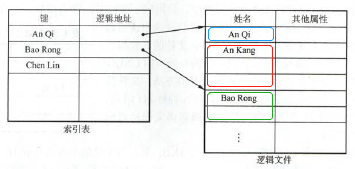
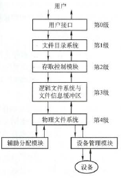
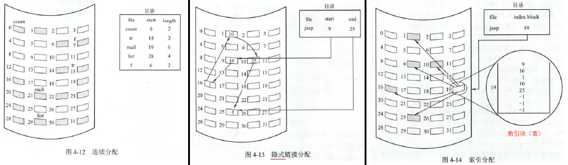
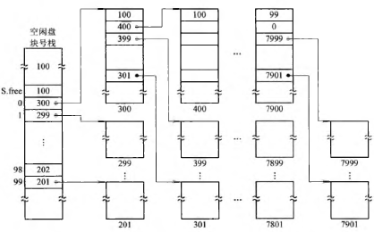

# 文件管理

## 文件系统基础

- **文件**
    - **结构化表述**：**数据项** → **记录** → **文件**
    - **属性**：类型、长度、物理位置、建立时间
    - **操作**
        - **基本操作**：**创建**、**删除**、**读**、**写**、**设置读写位置**
        - **打开（/关闭）**：系统调用open，将文件属性从外存拷贝到内存的**打开文件表**的一个表目（磁盘索引结点copy成内存索引结点），并**返回该表目指针**（UNIX为文件描述符，Windows为文件句柄）
- **文件的逻辑结构**
    - **无结构文件（流式文件）**：长度以**字节**为单位，利用读、写指针访问。多用于源程序、可执行文件、库函数
    - **有结构文件（记录式文件）**：分为**定长记录**（每条记录长度相等）和**变长记录**
        - **顺序文件**
            - **定长**
            - 分为**串结构**（类似链表）和**顺序结构**（类似数组）两种结构
            - **优点**：批量操作时效率高；只有顺序文件才能存储在磁带
            - **缺点**：不能**随机查找**，只能**顺序查找**，操作单条记录较困难
        - **索引文件**
            - **定长或变长**
            - **索引表**是顺序文件，记录着每个记录的地址和长度
            - 优缺点和顺序文件相反
        - **索引顺序文件**：结合顺序和索引
            - 
        - **直接文件/哈希文件**：没有顺序特性，通过键值哈希决定物理地址
- **文件控制块和索引结点**
    - **文件控制块FCB**：存放控制文件所需信息的数据结构
        - **基本信息**：文件名、物理位置、逻辑结构、物理结构
        - **存取控制信息**：存取权限
        - **使用信息**：建立时间、修改时间
    - **文件目录**就是FCB的有序集合
    - **索引结点inode**：可以理解为把文件名从FCB剥离出来，再添加一些信息。从而文件目录结构可以表达为一个索引表，它以**文件名为键，索引结点指针为值**，从而节省检索开销。分为磁盘索引结点、内存索引结点
- **目录结构**
    - **单级目录结构**：一个目录
    - **两级目录结构**：主文件目录 → 用户文件目录
    - **树形目录结构（多级目录结构）**
        - **绝对路径**、**相对路径**
    - **无环图目录结构**：方便**文件共享**，但管理复杂
- **文件共享**
    - **硬链接**：基于**索引结点**
        - 索引结点包含**链接计数count**表示链接到此文件的用户目录项的数目
    - **软链接**：**符号链接**
        - 即 **“快捷方式”**。共享者只知路径，不拥有索引结点
    
    !> 软链接作为新文件有**独立的count值**；不同进程打开同一文件对应**同一个**内存索引结点；**目录的链接计数-2=子目录数**，2分别是"."（自身）和".."（父目录）

- **文件保护**
    - **访问类型**：读、写、执行、删除、添加（append）、列表清单（列出文件名和属性）
    - **访问控制**
        - **访问控制列表ACL**：规定每个文件/目录于每个用户的所有访问权限
            - **精简的访问列表**：**所有者**、**用户组**、**其他**
        - **口令与密码**：前者直接存在系统内部，不安全；后者编/译码需要一定耗时

## 文件系统实现

- **文件系统层次结构**
    - 
    - **用户调用接口**：系统调用
    - **文件目录系统**：查找目录
    - **存取控制模块**：验证访问权限
    - **逻辑文件系统**：根据逻辑结构，得到逻辑地址
    - **物理文件系统**：得到物理地址
    - **辅助分配模块**：管理外存
    - **设备管理模块**：设备I/O
- **目录实现**
    - **线性列表**：实现简单，用链表可以加快插入和删除；但线性查找费时
    - **哈希表**：哈希查找迅速；但要减少冲突
- **文件实现**（文件的物理结构）
    - **文件分配方式**
        - **连续分配**：每个文件占有连续的块
            - **优缺点**：实现简单，存取速度快；但只适用于定长文件
        - **链接分配**：离散分配，指针链接
            - **优缺点**：磁盘空间利用率高，文件长度动态，易于增删改；但不可随机访问
            - 分为**隐式链接**和**显示链接**。区别在于中间指针隐式存在物理块中，还是显示存在内存里的**文件分配表**（一个跳转数组，$i\rightarrow f[i]$）中
        - **索引分配**：离散分配，文件所有盘块都存于**索引块（表）**
            - **优缺点**：可随机访问，易于增删改；但系统时空开销大
            - **大文件的解决方案**
                - **链接方案**：链接多个索引块
                - **多层索引**：第一层索引块指向第二层，以此迭代直到指向文件块
                - **混合索引**：多种索引方式混合。一般为多种不同层次的索引（直接地址、一级间址、二级间址、……），优先填充直接地址
        - 
    - **文件存储空间管理**
        - **文件存储空间初始化**
            - 文件存在**文件卷**中，文件卷分为存放数据信息的**文件区**和存放目录信息的**目录区**
            - 文件卷是**物理盘**的一部分。可能一个物理盘有多个文件卷，也可能一个文件卷对应多个物理盘
        - **文件存储空间管理**：对**空闲块**的管理
            - **空闲表法**：**空闲盘块表**的表头是序号、第一个空闲盘块号、空闲盘块数
            - **空闲链表法**：**空闲盘块链**是所有空闲盘块的链表；**空闲盘区链**是所有空闲盘区（包含多个盘块）的链表
            - **位示图法**：每个盘块用一位表示使用情况，0表空闲
                - 通常以n行m列的0/1矩阵表示，要会计算行、列到序号的转换
            - **成组链接法**（UNIX采用）
                - 每100个空闲盘块分成一组，将每组的盘块总数N和所有盘块号，记入其前一组的第一个盘块中。由此各组第一个盘块可连成一条链
                - **空闲盘块号栈**：存放链头，存在内存中
                - 

## 磁盘组织与管理

- **结构**（见计组笔记）
- **调度算法**
    - **先来先服务算法FCFS**
        - 公平，简单；性能差
    - **最短寻找时间优先算法SSTF**
        - 性能较好；可能会“饥饿”
    - **扫描算法SCAN（电梯调度）**：在SSTF基础上，只选择与磁头运动同向的请求
        - 避免“饥饿”，性能好；局部性较差
    - **循环扫描算法C-SCAN**：在SCAN基础上，规定磁头单向移动来服务，回返时不服务
    - **LOOK/C-LOOK算法**：分别对应SCAN和C-SCAN，区别在于**到达最远请求即返回**，不用到达顶点
    
    !> 有时也默认SCAN、C-SCAN为LOOK、C-LOOK

- **减少延迟时间的方法**：**扇区交替编号**、**盘面错位命名**
- **提高磁盘I/O的其他方法**：提前读、延迟写、优化物理块分布、虚拟盘
- **管理**
    - **初始化**：**低级格式化（物理分区） → 分区 → 逻辑格式化（创建文件系统）**
    - **引导与分区**
        - ROM中保留很小的**自举装入程序**，**自举程序**则保存在磁盘的**引导控制块**，用以初始化计算机的启动
        - **引导控制块**：通常为分区的第一块。UFS为引导块，NTFS为分区引导扇区
        - **分区控制块**：包括分区详细信息。UFS为超级块，NTFS为主控文件表
    - **坏块的处理**：简单磁盘手工处理，复杂磁盘用备用块（低级格式化时保留）代替坏块
