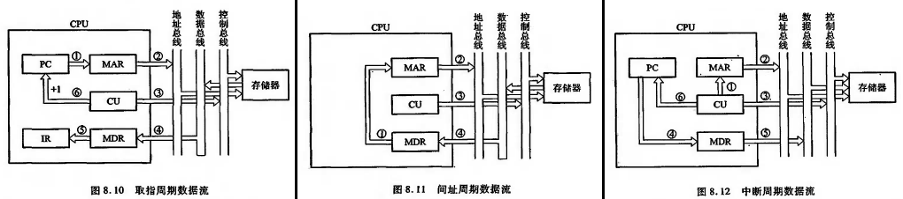
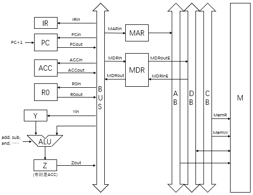
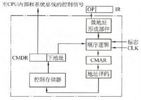
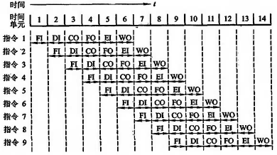
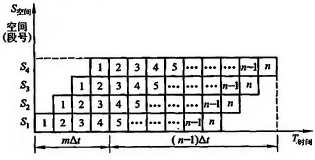
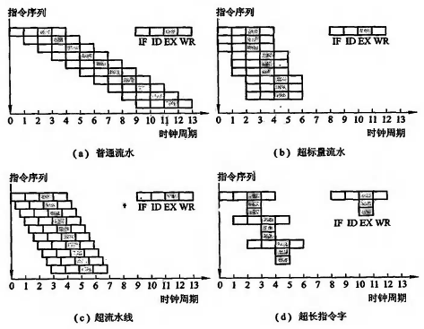

# 中央处理器CPU

- **功能**
    - **控制器功能**：**指令控制（取指、分析、执行）**、**操作控制**、**时间控制**、**中断处理**
    - **运算器功能**：**数据加工**
- **结构**
    - **运算器**
        1. **算术逻辑单元ALU**
        2. **通用寄存器组**：**累加器ACC**、**计数寄存器CX**（控制循环次数）、**基址寄存器BR**、**变址寄存器IX**、**堆栈指针寄存器SP**、……
        3. **程序状态字寄存器PSW**
            1. **进/借位标志CF**：**视作无符号数**，若减则作补码加，若最高位向前有进位则C=1。加法CF=C，减法CF=C XOR 1（即小减大为1）
            2. **溢出标志OF**：**只针对有符号数**，溢出则置1
            3. **符号标志SF**：结果最高位为1则置1
            4. **零标志ZF**：结果为0则置1
            5. 奇偶标志PF：结果低8位有偶数个1则置1
            6. 辅助进位AF：第4、5位间有进/借位则置1
        4.  **暂存器**：暂存数据，如**移位暂存器**
   - **控制器**
        1. **程序计数器PC**
        2. **指令寄存器IR**
        3. **存储器地址寄存器MAR**
        4. **存储器数据寄存器MDR**
        5. 指令译码器
        6. 时序系统
        7. 微操作信号发生器
- **寄存器用户可见性**
    |   -    |        用户可见         |  用户不可见  |
    | :----: | :---------------------: | :----------: |
    | 寄存器 | 通用寄存器、PSW、**PC** | IR、MAR、MDR |

## 指令执行过程

- **指令周期 = 取指周期 + 间址周期 + 执行周期 +中断周期**
    1. **取指周期**
        - 根据(PC)，从主存取指，存至IR
        - 控制器自动完成，耗时**一个机器周期**
        - **步骤**
            ```
            PC→MAR, 1→R (读)
            M(MAR)→MDR, (PC)+1→PC
            (MDR)→IR
            Op(IR)→CU (指令译码)
            ```

    2. **间址周期**
        - 根据(IR)地址码，从主存读有效地址，存至MDR
        - **步骤**
            ```
            Ad(IR)→MAR, 1→R (读)
            M(MAR)→MDR
            (MDR)→Ad(IR) (有时省略)
            ```

    3. **执行周期**
        - 根据(IR)中的操作码和操作数，通过ALU，产生执行结果
    4. **中断周期**
        - 处理中断请求
        - 步骤
            ```
            (SP)-1→SP
            (SP)→MAR, 1→W(写)
            PC→MDR
            (MDR)→M(MAR)
            向量地址→PC
            0→EINT（关中断）
            ```

    !> **间址周期**和**中断周期**不一定有。执行周期结束前会查询中断请求，没有就没有中断周期

    - 
- **多级时序系统：指令周期 - 机器周期 - 时钟周期**
    - **机器周期**：从内存读取一个指令字的最短时间（若存储字长=指令字长，则取指周期=机器周期）
    - 一个**指令周期**包含若干**机器周期**（CPU周期），一个**机器周期**包含若干**时钟周期**，且倍数**都可以不固定**
- **指令执行方案**
    |      方案      | 各指令时间 | 串/并行 |
    | :------------: | :--------: | :-----: |
    | **单指令周期** |    相同    |   串    |
    | **多指令周期** |    不同    |   串    |
    | **流水线方案** |    不同    |   并    |

## 数据通路

- 功能：实现数据在功能部件之间传送
- **基本结构**
    - **CPU内部总线方式**
        - **CPU内部单总线方式**：寄存器I/O端共享**一**条公共通路
        - **CPU内部多总线方式**：寄存器I/O端共享**多**条公共通路
    - **专用数据通路方式**：根据数据流向安排线路，避免共享总线。**性能高，但硬件量大**
    
    !> 区别CPU内部总线和系统总线

- **CPU内部单总线**
    - 
    - **控制信号**
        |     控制信号     |                        作用                        |
        | :--------------: | :------------------------------------------------: |
        |    $*_{out}$     |         控制**三态门**将寄存器值输出到总线         |
        |     $*_{in}$     | 控制寄存器**使能端**将总线数据锁存（**时钟驱动**） |
        | $PC+1, add, sub$ |                    运算控制信号                    |
        |   $MemR, MemW$   |          内存读写控制信号（**时钟驱动**）          |

    !> AB单向传输，DB双向传输

## 控制器

- **CU的外特性**
    - 输入信号：CLK、IR、标志、系统总线控制信号
    - 输出信号：片内控制信号、系统总线控制信号
- **CPU的控制方式**
    1. **同步控制**：统一时钟，通常以最长微操作序列为标准。电路简单，速度慢
    2. **异步控制**：各部件按自身固有速度工作。电路复杂，速度快
    3. **联合控制**：折中，大部分同步，小部分异步
- **硬布线控制器**
    - 工作原理：微操作控制信号由组合逻辑电路根据当前指令码、状态和时序即时产生
    - **节拍安排原则**
        1. 注意微操作先后次序
        2. 控制对象不同的微操作，若能一节拍完成，应尽量安排在同一节拍完成
        3. 有些微操作耗时短，应安排在同一节拍完成，且允许它们之间有先后次序
    - **硬布线CU设计步骤**
        1. 列出微操作命令的**操作时间表**
            - 表头：机器周期、节拍、状态条件、微操作命令、各操作码
        2. 写出微操作命令的**最简逻辑表达式**
            - **逻辑表达式 = ∑ (机器周期 AND 节拍 AND 状态条件 AND 操作码)** ，其中操作码指操作码译码器输出
        3. 画出微操作命令的**逻辑图**
- **微程序控制器**
    - 工作原理：微操作控制信号以微程序形式存放在控制存储器中，执行指令时读出
    - **基本概念**
        - **微命令、微指令、微程序**
            1. **微命令**：构成控制序列的最小单位
                1. 一个微命令可能和一些微命令**相容**，而和另一些微命令**互斥**
                2. 硬布线控制器也有微命令
            2. **微指令**：若干微命令的集合。一个机器周期对应一个微指令
                1. **操作控制字段（微操作码字段）**：产生各种控制信号
                2. **顺序控制字段（微地址码字段）**：产生下一条微指令地址
            3. **微程序**：微指令的有序集合。一条机器指令对应一个微程序，但有时也称“取指周期微程序”等
        - **控制存储器CM**：存放所有微程序，片内，**ROM**实现，简称**控存**
        - **微地址形成部件**：用于产生初始微地址和后续微地址
        - 几个可类比概念：**微（指令）周期**、**微地址寄存器CMAR**、**微指令寄存器μIR**
        - 动态微程序设计：能根据用户要求，更改微程序
        - 毫微程序设计：硬件不由微程序控制，而通过存放在第二级控存中的毫微程序解释
    - **基本结构**
        - 
    - **编码方式**
        1. **直接编码（直接控制）**
            - 微指令的操作控制字段中每一位代表一个微命令，无须译码
            - 简单，速度快，微指令字长最长
        2. **字段直接编码（显式编码）**
            - 操作控制字段分成若干段，将微命令互斥的放在同一字段，相容的放在不同字段，对字段译码
            - 速度稍慢，微指令字长稍短
            
            !> “不发微命令”也需要一种状态表示

        3. **字段间接编码（隐式编码）**
            - 一个字段的某些微命令，通过另一字段的某些微命令解释
            - 微指令字长最短。削弱了微指令的并行控制能力，通常作为字段直接编码的辅助手段
    - **后继微指令地址形式方式**
        1. **直接由微指令的*下地址字段*指出**，又叫**断定方式**
        2. **根据机器指令操作码形成**（经由微地址形成部件）
        3. 增量计数器法：(CMAR)+1→CMAR，只适用于后续微指令地址连续
        4. 分支转移：标志（判断测试字段）决定跳转分支
        5. 通过测试网络形成
        6. 由硬件产生微程序入口地址
    - **微指令格式**
        - **水平型微指令**
            - **操作控制字段 + 顺序控制字段(判断测试字段 + 下地址字段)**
            - 其中判断测试字段即分支转移的条件，满足则转后继，否则顺序执行
            - 一次能定义并执行多个并行操作，并行能力强
            - 微程序短，微指令字长
            - 执行速度快
        - **垂直型微指令**
            - **微操作码 + 目的地址 + 源地址**，与机器指令类似
            - 一条微指令只有1-2个微命令，并行能力差
            - 微程序长，微指令字短
            - 执行速度慢
    - **微程序CU设计步骤**
        1. 写出机器指令对应的微操作命令和节拍安排
            - 取指（注意不同）
                ```
                PC→MAR, 1→R (读)
                Ad(CMDR)→CMAR              ; 取微指令  
                M(MAR)→MDR, (PC)+1→PC
                Ad(CMDR)→CMAR              ; 取微指令 
                (MDR)→IR
                Op(IR)→微地址形成部件→CMAR  ; 形成后继微指令地址
                ```

        2. 确定微指令格式：编码方式、后继微指令地址形式方式、微指令字长等
        3. 编写微指令码点

## 指令流水线

- **基本概念**
    - **流水线**：一种**时间并行**技术。如将指令分成六个阶段：**取指FI**、**指令译码DI**、**计算操作数地址CO**、**取操作数FO**、**执行指令EI**、**写操作数WO**，可以实现指令的六级流水
        - 
    - **按序发射**：下一条指令的**取指**和上一条指令的**译码**并行
    - **按序完成（提交）**：不同指令最后一步按序进行
- **影响性能的因素（相关/冲突/冒险）**
    1. **结构相关（资源相关）**
        - 含义：不同指令争用同一部件产生资源冲突
        - 解决
            1. 完成前一条指令对数据存储器访问时，暂停取后一条指令
            2. 设置**独立存储器**分别存放操作数和指令
            3. 采用**指令预取技术**，将指令预取到指令队列中，这样取操作数操作便可以独占存储器访问
    2. **数据相关**
        - 含义：不同指令重叠操作，可能改变对操作数的读写访问顺序
        - 情形：写后读RAW、读后写WAR、写后写WAW。**按序流动时只有RAW相关**（准确说是按序完成）
        - 解决
            1. **后推法**：遇到数据相关时，停顿后继指令运行，直到前面指令生成结果
            2. **定向技术（旁路技术）**：将某条指令执行结果不送回寄存器，而是直接送到其他指令所需要的地方
    3. **控制相关**
        - 含义：由转移指令引起，若是条件转移指令，则转移目标地址可能发生跳转，影响流水线效率
        - 解决
            1. 尽早判别转移是否发生，尽早生成转移目标地址
            2. 预取转移成功和不成功两个方向的目标指令
            3. 加快和提前形成条件码
            4. 提高转移方向猜准率
- **性能指标**
    1. **吞吐率TP**
        - 含义：单位时间内流水线完成的任务数或输出结果数
        - **最大吞吐率**：$T_{pmax}=\frac{1}{\Delta t}$
        - 完成n个任务的**实际吞吐率**：$T_p=\frac{n}{(m+n-1)\Delta t}$
    2. **加速比**
        - 含义：m段流水线速度与等功能非流水线速度之比
        - $S=\frac{nm\Delta t}{(m+n-1)\Delta t}=\frac{nm}{m+n-1}$
    3. **效率**
        - 含义：流水线各段工作时间时空区与总时空区面积之比
        - $E=\frac{nm\Delta t}{m(m+n-1)\Delta t}=\frac{n}{m+n-1}$
    - **流水线时空图**
        - 
        
        !> 有两种时空图，一种纵坐标是指令阶段（IF/ID/EX/WR/...），一种纵坐标是指令

- **流水线调度**
    - **静态调度**：用**编译器**对指令进行重排以避免阻塞
    - **动态调度**：用**专门硬件**对指令进行重排以避免阻塞
- **多发技术**
    1. **超标量流水线**
        - 每个时钟周期内并发k条独立指令，k为**处理机的度**
        - 常结合**动态调度**
    2. **超流水线**：每个时钟周期内再分段，一个功能部件使用多次
    3. **超长指令字**
        - 由编译程序挖掘指令间潜在的并行性，将多条能并行的指令组合成一条具有多个操作码字段的超长指令字，为此需要采用多个处理部件
        - 都是**静态调度**
    - 
