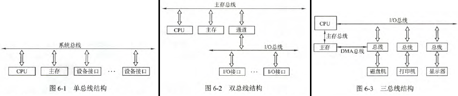
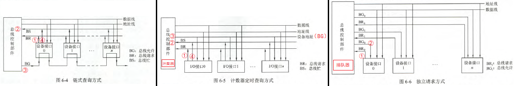
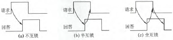

# 总线

## 概述

- **定义**：一组能为多个部件**分时共享**的公共信息传送线路
- **特点**
	- **分时**：同时向总线发送数据的只能有一个部件，**但接收的可以有多个**
	- **共享**：总线上挂接多个部件
- **优点**：（相比分散连接）便于增减外设、减少连线
- **总线设备**
	- **主设备**：对总线有控制权
	- **从设备**：响应从主设备发来的总线信号
- **传输方式**
	- **常规传输**：一次传输一个地址和一个数据
	- **猝发（突发）传输**：在一个总线周期内，传输多个存储地址连续的数据，即一次传输一个地址和多个数据
- **分类**
	- **按数据传输格式**
		1. **串行总线**：一条数据总线
		2. **并行总线**：多条数据总线
		- 串行适合远距离，并行适合近距离
		- 由于串扰等原因，**高速传输串行比并行快**
	- **按功能**
		- **片内总线**：CPU内部的通信总线
		- **系统总线**：计算机各部件之间的通信总线
            |    系统总线    |         传输内容          |       方向性       |     位数取决于     |
            | :------------: | :-----------------------: | :----------------: | :----------------: |
            | **数据总线DB** |         数据信息          |        双向        | 机器字长、存储字长 |
            | **地址总线AB** | 主存单元地址、I/O端口地址 |        单向        |    存储单元个数    |
            | **控制总线CB** |       传输控制信号        | 个体单向、总体双向 |         -          |

		- **通信总线**：计算机系统之间或计算机与其他系统之间的通信总线
- **系统总线结构**
	1. **单总线结构**：**系统总线**
		- 优点：结构简单，便于扩展
		- 缺点：竞争激烈，不支持并发，效率低
	2. **双总线结构**：**主存总线 + I/O总线**
		- 优点：分离出低速I/O设备
		- 缺点：增加通道等硬件
	3. **三总线结构**：**主存总线 + I/O总线 + DMA总线**
		- 优点：快速响应，吞吐量高
	- 
	
	!> 此“单/双/三”以“组”为单位，而不是“根”

- **性能指标**
	- **总线周期**：一次总线操作耗时
		- 一般为总线时钟周期的整倍
	- **总线频率**：1/总线周期
	- 总线时钟周期：机器的时钟周期
	- 总线时钟频率：1/时钟周期
	- **总线宽度（总线位宽）**：**数据总线**的根数
	- **总线带宽**：总线的数据传输率
		- **= 总线宽度 × 总线频率 (b/s)**
- **总线复用**：一种信号线在不同时间传输不同信息（数据/地址）

## 总线仲裁

- **含义**：多个设备竞争总线控制权时，决定哪个设备作为主设备
- **方式**
	- **集中仲裁**：将总线请求集中于一个设备仲裁
        |      仲裁方式      | 控制线                                          | 优点                 | 缺点                   |
        | :----------------: | :---------------------------------------------- | :------------------- | :--------------------- |
        |    **链式查询**    | BR:$1$ BS:$1$ BG:$1$                            | 结构简单、易扩充     | 优先级不灵活、故障敏感 |
        | **计数器定时查询** | BR:$1$ BS:$1$ 设备地址:$\lceil \log_{2}n\rceil$ | 优先级较灵活         | 控制较复杂             |
        |    **独立请求**    | BR:$n$ BS:$1$ BG:$n$                            | 优先级最灵活、响应快 | 控制最复杂             |

		- **总线请求BR**、**总线忙BS**、**总线允许BG**
		- 
		
		!> 计数器定时查询没有BG，改叫设备地址线
		
	- **分布仲裁**：不需要中央仲裁器，比较仲裁号大小决策

## 总线操作和定时

- **总线传输四个阶段**
	- **申请分配阶段**：**传输请求** + **总线仲裁**
	- **寻址阶段**：主设备通过总线发出从设备地址
	- **传输阶段**：主从设备数据交换
	- **结束阶段**：主设备让出总线使用权
- **总线定时方式**
	- **同步定时**：统一时钟信号协调收发双方
		- **缺点**：强制性同步，可靠性差
		- 适用于**总线长度短、部件存取时间相近**的系统
	- **异步定时**：完全依靠“握手”信号实现定时
		- **缺点**：传输慢，控制复杂
		- **三种类型**：**不互锁方式**、**半互锁方式**、**全互锁方式**
			- 
	- **半同步定时**：在同步定时基础上，引入等待信号，解决不同速度设备的通信问题
	- **分离式通信**：发送和接收方分别作为主设备做一次同步发送，不等待应答而直接放弃总线控制权
		- **优点**：总线利用率高
		- **缺点**：控制复杂

## 总线标准

- **局部总线**：将外设通过**局部总线控制器（桥接器）**，直接与CPU总线相连，从而为外设提供高速传输信道
- **常见总线标准**
    |      标准      |     特点     |               用途               |                      备注                       |
    | :------------: | :----------: | :------------------------------: | :---------------------------------------------: |
    |    **ISA**     |   系统总线   |             16位CPU              |                   不支持仲裁                    |
    |    **EISA**    |   系统总线   |             32位CPU              |                     兼容ISA                     |
    |    **VESA**    |   局部总线   |               显卡               |                                                 |
    |    **PCI**     |   局部总线   |        显卡、声卡、网卡等        | 支持猝发传输；即插即用；多主设备；兼容ISA、EISA |
    |    **AGP**     |   局部总线   |             显卡专用             |                   点对点连接                    |
    |   **PCI-E**    |   局部总线   |           取代PCI、AGP           |      点对点连接；**串行**（以上都是并行）       |
    |  **RS-232C**   | 串行通信总线 |       DTE和DCE之间串行通信       |                                                 |
    |    **USB**     | 串行设备总线 |         外部设备串行通信         |                即插即用、热插拔                 |
    |   **PCMCIA**   | 便携设备接口 |          笔记本电脑扩展          |                                                 |
    | **IDE（ATA）** | 硬盘光驱接口 |            硬盘、光驱            |                                                 |
    |    **SCSI**    | 智能通用接口 | 智能设备（硬盘、光驱、打印机等） |                                                 |
    |    **SATA**    | 串行硬盘接口 |               硬盘               |                                                 |

- **异步串行通信**
	- **帧格式**
        |  用途  |  位数   | 电平  |
        | :----: | :-----: | :---: |
        | 起始位 |    1    |   0   |
        | 数据位 |    n    |  0/1  |
        | 校验位 |   0/1   |  0/1  |
        | 停止位 | 1/1.5/2 |   1   |
        | 空闲位 |  若干   |   1   |
