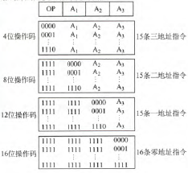

# 指令系统

## 指令格式

- **指令 = 操作码 + 地址码**
- 主存多为字节编址 ⇒ **指令字长多为字节整倍**
- 所有指令字长相等称为**定长指令字结构**，否则为**变长指令字结构**
- **指令分类**
	- 按与机器字长关系分：**单/半/双字长指令**
	- 按操作数个数分：**零/一/二/三/四地址指令**
	- **按操作码长度分**
		- **定长操作码指令**：固定指令字最高n位为操作码
		- **扩展操作码指令**
			- **目的**：指令长度不变前提下增加指令数
			- **设计原则**
				- 操作码不重复
				- 操作码不能是另一操作码**前缀**
				- 一般使用频率越高，分配操作码越短
			- 

## 指令的寻址方式

- **形式地址和有效地址**
	- **形式地址A**：操作数地址码
	- **有效地址EA**：形式地址结合寻址方式，得到存储器中的真实地址
- **指令寻址和数据寻址**
	- **指令寻址**
		- **顺序寻址**
		- **跳跃寻址**
	- **数据寻址**
		- 常添加**寻址特征**字段，即**指令 = 操作码 + *寻址特征* + 形式地址A**
- **常见寻址方式**
    |    寻址方式    |  有效地址   | 访存次数 |            备注             |
    | :------------: | :---------: | :------: | :-------------------------: |
    |    隐含寻址    |  程序指定   |    0     |
    |    立即寻址    | $A$即操作数 |    0     |
    |    直接寻址    |   $EA=A$    |    1     |
    |    间接寻址    |  $EA=(A)$   |    2     |   此处一次间接，还可多次    |
    |   寄存器寻址   |  $EA=R_i$   |    0     |
    | 寄存器间接寻址 | $EA=(R_i)$  |    1     |   此处一次间接，还可多次    |
    |    相对寻址    | $EA=(PC)+A$ |    1     | A为补码；(PC)先加当前指令长 |
    |    基址寻址    | $EA=(BR)+A$ |    1     |
    |    变址寻址    | $EA=(IX)+A$ |    1     |
    |   堆栈寻址\*   |  $EA=(SP)$  |    1     |    本质是寄存器间接寻址     |

	- **基址寻址与变址寻址的不同**
		- 基址寄存器BR**面向操作系统**，主要用于为程序或数据分配存储空间；变址寄存器IX**面向用户**，主要用于处理**数组**问题
		- 基址寻址中， **(BR)为不变的基地址**，A为可变的偏移量；变址寻址中， **(IX)为可变的偏移量**，A为不变的基地址
	- **硬堆栈和软堆栈**
		- **硬堆栈（寄存器堆栈）**：寄存器作堆栈，不适合大容量
		- **软堆栈**：主存中划一块做堆栈
		
        !> XX**间址**也表间接

		!> 栈顶向着低地址，即进栈是SP减1

## CISC和RISC

|      项目      |        CISC        |        RISC        |
| :------------: | :----------------: | :----------------: |
|      全称      | 复杂指令系统计算机 | 精简指令系统计算机 |
|    指令系统    |      复杂庞大      |        精简        |
|    指令数目    |        >200        |       <1000        |
|    指令字长    |      **变长**      |      **定长**      |
|    边界对齐    |        都可        |         是         |
|   可访存指令   |       不受限       |   只有Load/Store   |
|    指令耗时    |       相差大       | 多为一个时钟周期内 |
|    指令频度    |       相差大       |       都常用       |
| 通用寄存器数量 |         少         |         多         |
|    编译优化    |         难         |        重视        |
|    控制方式    |   多为**微程序**   |   多为**硬布线**   |
|   控制器面积   |         大         |         小         |
|   指令流水线   |      可以实现      |    **必须采用**    |
|   向后兼容性   |         好         |         差         |
|      典型      |        X86         |        ARM         |
