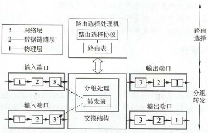
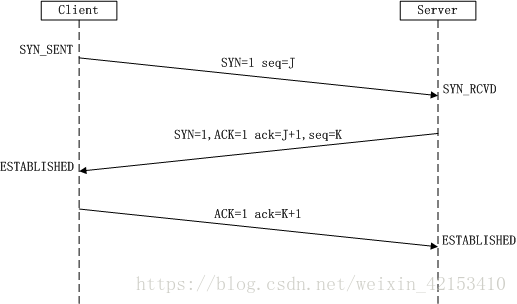

# 传输层（未完）

## 传输层提供的服务

- **传输层的功能**
- **传输层寻址与端口**
- **无连接服务与面向连接服务**

## UDP协议

- **UDP数据报**
- **UDP校验**

## TCP协议

- **TCP段**
- **TCP连接管理**
- **TCP可靠传输**
- **TCP流量控制与拥塞控制**

## 面试临时补充（TODO）

1. **从输入URL到展现页面的全过程**
    1. **查看缓存**：如果请求资源再缓存中还新鲜，就直接使用，否则再进行下一步
    2. **浏览器组装HTTP请求报文**
    3. **DNS解析**：浏览器将请求的URL交给DNS域名解析，找到服务器真实IP
    4. **TCP连接**：得到服务器IP后，对其发起TCP三次握手建立连接
    5. **发送HTTP请求**：发生在TCP连接建立后
    6. **服务器处理请求**：处理后得到反馈的HTTP报文，通过TCP发送回给浏览器
    7. **浏览器接收HTTP响应**：然后根据情况选择是否关闭TCP连接
    8. **浏览器检查响应状态码**
    9. **还可能进行缓存**
    10. 浏览器根据得到的HTTP数据包，包括html、css、js等，**解析渲染页面**
2. **TCP与UDP**
    1. **异同**
        1. **共同**：**位于传输层**
        2. **区别**
        
        |            |        TCP         |   UDP    |
        | :--------: | :----------------: | :------: |
        | **可靠性** | 可靠（正确、有序） |  不可靠  |
        | **连接性** |      面向连接      |  无连接  |
        |  **报文**  |     面向字节流     | 面向报文 |
        |  **效率**  |         低         |    高    |

    2. **TCP怎么保证可靠传输**
        1. **ARQ协议**：每发完一个分组就停止发送，等待对方确认，收到确认后再发下一个分组
        2. **超时重传**：当TCP发出一个段后，启动一个定时器，等待对方确认收到这个报文段。如果不能及时收到确认，就重发这个报文段
        3. **校验和**：TCP保持它首部和数据的检验和。如果收到的检验和有差错，就丢弃这个报文段，不确认收到此报文段
        4. **拥塞控制**：当网络拥塞时，减少数据的发送。
    3. **TCP拥塞控制**
        1. **目标**：最大化利用网络瓶颈链路的带宽
        2. **算法**
            1. **Reno**
            2. **四个阶段**
                1. **慢启动**：一开始先不要发送大量数据，先探测拥塞的程度。从小到大**指数倍增**发包，出现丢包后拥塞窗口减半，进入拥塞避免状态
                2. **拥塞避免**：拥塞窗口每轮以线性增长，当收到一个报文的三个重复ACK时认定丢失，进入下一状态
                3. **快重传**：要求接收方收到失序报文段就立即发出重复确认，而不是捎带发送
                4. **快恢复**：修改拥塞窗口和慢启动阈值为当前拥塞窗口的一半，然后进入拥塞避免阶段
            3. **BBR**
        3. **UDP不需要拥塞控制**
    4. **三次握手**
        1. **过程**
            1. 首先，客户端与服务器均处于未连接状态，并且是客户端主动向服务器请求建立连接
            2. 客户端将报文段中的SYN=1，并选择一个seq=x（即该请求报文的序号为x），将这个报文发送到服务器。此时，客户端进入同步已发送状态（SYN-SEND）。SYN报文段不能携带数据，但是要消耗掉一个序号。
            3. 服务器收到请求报文后，若同意建立连接，则回复报文中，SYN=1,ACK=1，并选择一个seq = y,且报文中确认号为x+1，序号为y。此时服务器进入同步已接收状态（SYN-RCVD）
            4. 客户端收到服务器的同步确认后，对服务器发送确认的确认。将ACK=1,确认号为y+1,而报文首部的序号为x+1，将该报文发出后，客户端进入ESTABLISHED状态
            5. 服务器收到客户端的确认后，也进入ESTABLISHED状态
        2. **图**
            
        

    5. **四次挥手**
        1. **过程**
            1. 客户端向服务器发送FIN报文：FIN=1,序号seq=上一个最后传输的字节序号+1=u，发送后，客户端进入FIN-WAIT-1状态
            2. 服务器接收到该报文后，发送一个确认报文：令ACK=1，确认序号ack = u+1,自己的报文序号seq=v，发送后，服务器进入CLOSE-WAIT状态
            3. 此时TCP连接进入连接半关闭状态，服务器可能还会向客户端发送一些数据。
            4. 客户端收到来自服务器的确认之后，进入FIN-WAIT-2状态。等待服务器发送连接释放报文
            5. 如果服务器已经没有要发送的数据，则释放TCP连接，向客户端发送报文：令FIN=1，ACK=1,确认号ack =u+1，自己的序号seq = w（w可能等于v也可能大于v），服务器进入LAST-ACK状态
            6. 客户端收到服务器的连接释放报文后，对该报文发出确认，令ACK=1,确认号ack=w+1，自己的序号seq=u+1，发送此报文后，等待2个msl时间后，进入CLOSED状态
            7. 服务器收到客户端的确认后，也进入CLOSED状态并撤销传输控制块
        2. **图**
        
        

3. **HTTP与HTTPS有哪些区别**
    1. https协议需要到ca申请证书，一般要收取费用
    2. http是超文本传输协议，连接简单，没有状态，信息是明文传输；https是具有安全性的ssl加密传输协议，安全得多
    3. http和https用的端口不一样，http是80，https是443
4. **HTTPS的加密与认证过程**
    1. 客户端发起一个**https请求**，连接到服务器的443端口
    2. 服务端把自己的信息以**数字证书**的形式返回给客户端，内容有非对称加密算法产生的公钥、网站地址、证书颁发机构、失效日期等。私钥由对称加密算法产生，由服务器自己持有
    3. **验证证书的合法性**。客户端收到服务器的响应后会先验证证书的合法性，比如证书中包含的地址和正在访问的地址是否一致、证书是否过期
    4. **生成随机密码（RSA签名）**。如果验证通过，浏览器就会生成一个随机的对称密钥，并用公钥来加密，让服务端用私钥解密。解密后就用这个对称密钥进行传输了，并且能够说明服务端确实是私钥的持有者
5. **常见的HTTP状态码的含义**
    1. 1xx：**信息**。服务器收到请求，请继续执行请求
    2. 2xx：**成功**。请求被成功接收并处理；如200请求成功
    3. 3xx：**重定向**。需要进一步操作来完成请求；如301资源永久转移到其他URL
    4. 4xx：**客户端错误**。无法完成请求，或请求包含语法错误；如404资源不存在
    5. 5xx：**服务器错误**。服务器在处理请求的过程中发成错误；如500内部服务器错误，502网关收到无效响应
6. **HTTP方法**
    1. **GET**：请求从服务器获取资源，可以是文本、图片、视频等
    2. **HEAD**：获取资源的元信息。类似GET，但服务器不会返回请求的实体数据，而只返回响应头
    3. **POST**：向URI资源提交数据，数据放在报文body里，用于上传数据
    4. **PUT**：类似POST。一般POST用于新建数据，而PUT用于更新数据
    5. DELETE：删除资源
    6. CONNECT：建立特殊的连接隧道
    7. OPTIONS：列出可对资源实行的方法
    8. TRACE：追踪请求-响应的传输路径
7.  **跨域请求**
8.  DNS查询服务器的基本流程，DNS劫持
9.  TCP粘包和拆包
10. 对称与非对称加密
11. HTTP1.0，1.1，2.0主要区别
12. JWT的原理和校验机制
13. Cookie和Session的关系和区别是什么
14. RPC的调用过程
15. 为什么需要序列化？有什么序列化的方式？