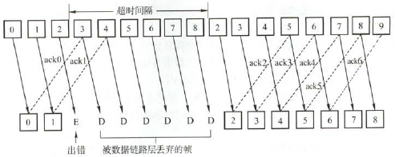
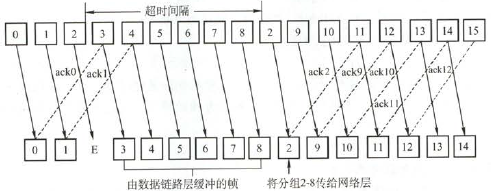
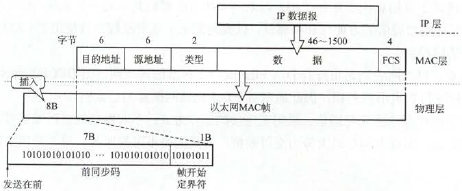
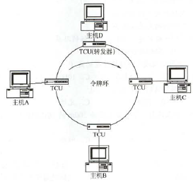
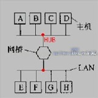
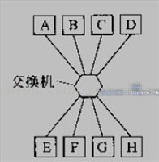

# 数据链路层（未完）

## 数据链路层的功能

- **逻辑链路控制子层LLC**：与传输媒体无关
    - **为网络层提供服务**：无确定无连接服务、有确定无连接服务、有确定面向连接服务
    
    !> 连接必确定

    - **链路管理**：连接的建立、维持、释放
    - **流量控制**
- **介质访问控制子层MAC**：与传输媒体有关
    - **组帧（成帧）**
    - **差错控制**

## 组帧（成帧）

- **目的**：出错时只用重发出错帧，不用全部重发
- **解决问题**
    - **帧定界**：发送方确定帧的首尾界限
    - **帧同步**：接收方分辨帧的首尾界限
    - **透明传输**：防止帧定界符恰好出现在数据中导致误以为传输结束
- **方法**
    - **字符计数法**：帧头标明帧长
    - **首尾定界符法（字符填充法）**：两个字符“DLE STX”表起始，两个字符“DLE ETX”表结束，其中DLE是转义字符。数据段含DLE时转成两个DLE
    - **首尾标志法（比特填充法）**：比特流中“01111110”标志起止。若数据段遇到连续5个1则后面加一个0
    - **违规编码法**：数据编码集以外的编码表起止。例如曼彻斯特编码中“高-高”和“低-低”电平对在数据中违规

## 差错控制

- **差错原因**：噪声
- **差错类型**
    - **位错**：帧中某些位出错
        - **自动重传请求（ARQ方式）**：检错，通知发送方（如直接丢弃使发送方超时），直到收到正确码字
        - **前向纠错（FEC方式）**：检错，且能直接纠错
    - **帧错**：帧丢失、重复、时序
        - **解决**：引入计时器和编号机制
- **查/纠错编码**（见计组笔记）
    - **查错编码**：奇偶校验码、循环冗余码CRC
    - **纠错编码**：海明码

## 流量控制与可靠传输机制

- **流量控制目的**：限制发送方数据流量，防止其发送速率超过接收方缓冲空间接收能力
- **可靠传输机制**
    - **确认帧**：一种无数据的控制帧，接收方给发送方的反馈
        - **捎带确认**：将确认捎带在一个回复帧里
    - **超时重传**：发送某数据帧后开始计时，接收确认帧超时则重发该帧
- **滑动窗口机制**
    - 在帧序列上
        - 发送方维持长度为$W_T$的**发送窗口**，当帧在发送窗口内才允许发送。收到一*确认帧*后，将发送窗口后挪一格
        - 接收方维持长度为$W_R$的**接收窗口**，当帧在接收窗口内才允许接收。收到一*数据帧*后，将接收窗口后挪一格
    - **特点**
        - 发送窗口必须等接收窗口先滑动才能相应滑动
        - $W_R=1$才能保证有序接收
        - $W_T$和$W_R$固定
    - **信道指标**
        - **发送周期**：从发送数据帧到接收到相应确认帧的时间，等于**数据帧发送时延 + 数据帧传播时延 + 确认帧发送时延 + 确认帧传播时延**
        - **信道利用率 = 发送时间 / 发送周期 = $\frac{L/C}{T}$** ，其中$L$是发送周期内发送比特数，$C$是比特率，$T$是发送周期
            - 对于滑动窗口机制，若第一帧的确认帧到达发送端的同时，发送窗口内的帧恰好发送完毕，则说明时刻都在发送，信道利用率为100%
        - **信道吞吐率 = 信道利用率 × 比特率 = $\frac{L}{T}$**
- **停止-等待协议**：$W_T=1,W_R=1$。相当于双方交替发送一帧
    - 数据帧交替用0和1标识，对应确认帧分别用ACK1和ACK0表示
    - **信道利用率**：低
    - **伪代码**
        ```
        发送方：
            发送x并计时等待确认
            收到ACK(1-x) => 发送下一帧
            收到ACK(x) => 丢弃，继续等
            超时 => 重发x

        接收方：
            等待接收数据x
            收到x =>
                数据正确 => 发送ACK(1-x)
                数据错误 => 丢弃，继续等
            收到(1-x) => 发送ACK(x)，继续等
        ```

- **后退N帧协议GBN**：$W_T>1,W_R=1$
    - 
    - 对某数据帧确认意味着此前所有数据帧都正确。接收端可以连续接收多个正确数据帧后再确认最后一帧
    - **窗口长度**：$W_T\leq 2^n-1$（重点），n为帧编号位数。否则无法分辨确认帧是不是本轮的确认
    - **信道利用率**：一定程度上提高，但BER较大时不一定优于停止-等待协议
- **选择重传协议SR**：$W_T>1,W_R>1$
    - 
    - 接收方发送**否定帧NAK**指出需要重传的帧
    - **窗口长度**：$W_R\leq W_T\leq2^{n-1}$，n为帧编号位数。否则无法分辨确认帧是不是本轮的确认。一般相等
    - **信道利用率**：进一步提高

## 介质访问控制MAC

- **目的**：解决多个结点的广播信道中，信道资源的分配问题。属于数据链路层的一个子层
- **方式**
    - **信道划分**：通过多路复用把一条广播信道逻辑上分为多条独立的子信道
        - **频分多路复用FDM**：不同频率载波复用
        - **时分多路复用TDM**：分成时间片轮流分配给多路信号
        - **波分多路复用WDM**：光纤上不同波长的光信号复用
        - **码分多路复用CDM**：编码上区分各路信号
            - 不同站点有不同的相互正交的比特（1或-1）向量，称为**码片序列**
            - 某站点若发送0则发送码片序列的反向量，1则发送码片序列
            - 链路上的接收向量是发送的各向量的和，接收向量与对应码片序列**规格化内积**即可恢复该传输比特
        
        !> 复用≈多址，前者针对资源，后者针对用户

    - **随机访问**
        - **ALOHA协议**
            - **纯ALOHA**：一段时间未确认即认为冲突，等一段随机时间重发。吞吐量很低
            - **时隙ALOHA**：传送一个帧的时间为一个**时隙**。在纯ALOHA的基础上，将时间按时隙划分，只能以时隙为单位发送帧。吞吐量是纯ALOHA两倍，但仍很低
        - **CSMA协议**：在时隙ALOHA基础上，加一个**载波侦听**装置来侦听信道状态
            - **分类**
                |    协议    |               空闲策略               |              忙策略              |
                | :--------: | :----------------------------------: | :------------------------------: |
                | **1-坚持** |                 发送                 |             坚持侦听             |
                | **非坚持** |                 发送                 | 放弃侦听，等待一段随机时间再侦听 |
                | **p-坚持** | 概率p发送，概率(1-p)不发送但坚持侦听 |             坚持侦听             |
        - **CSMA/CD协议**：在1-坚持CSMA基础上，加上**碰撞检测**
            - **碰撞检测**：边发送边侦听冲突，不用等超时。若冲突则等一段随机时间重发
            - **争用期**：发送后的2τ时间内，τ为单程传播时延。只有争用期可能冲突
            - **最小帧长 = 2τ × 比特率**。低于最小帧长则为冲突导致的无效帧
            - **二进制指数退避算法**：碰撞后防止再碰撞
                - 从$[0,1,...,2^k-1]$中随机取$r$，其中$k=\min(\text{重传次数},10)$，则 **退避时间=$2\tau r$** 。重传达16次则放弃
            - **应用**：以太网
        - **CSMA/CA协议**：在1-坚持CSMA基础上，加上**碰撞避免**
            - **碰撞避免**：信道从忙变闲时，任何要发送的站都需要等待一段时间（DIFS，事先约定），然后进入争用窗口（二进制指数退避）
            - 当且仅当信道空闲且数据帧是第一帧才不退避
            - 即使遇到冲突，也要把整个帧发完
            - **三种机制**：**预约信道**、**ACK帧**、**RTS/CTS帧（请求/允许发送，可选机制）**
            - **应用**：IEEE 802.11
            
            !> 碰撞避免并不是完全避免，只是减少概率

    - **轮询访问**
        - **令牌传递协议**
            - 令牌传递网络在逻辑上是一个环（物理上未必是），一个**令牌**在环上一直单向传送
            - 某站想发送帧时，必须等待令牌，收到后在令牌中附加数据变成帧。环上所有站都转发数据，直到令牌回到始发站，释放令牌
            - 目的站收到帧后除转发，还复制一个副本，并在帧尾添加“响应比特”来确认
            - **应用**：令牌环，负载高的广播信道

## 局域网LAN

- **以太网与IEEE 802.3**：最广泛的**有线局域网**
    - **逻辑拓扑结构**：**总线形**
    - **数据链路层**：包括**逻辑链路控制子层LLC**和**介质访问控制子层MAC**
    - **两个标准**（差别很小）
        - **以太网V2**：对应TCP/IP体系；没有LLC层
        - **IEEE 802.3**：对应OSI体系
    - **MAC协议**：CSMA/CD
    - **特点**：无连接，不可靠，不编号数据帧，无确认帧
    - **网卡（网络适配器）**：装有处理器和存储器，工作在数据链路层和物理层，局域网中连接计算机和传输介质的接口
    - **MAC地址（物理地址）**：每块网卡出厂时的一个唯一代码
        - 长度6B。高24位为厂商代码，低24位为网卡序列号
    - **MAC帧**（默认以太网V2标准）
        - 
        
        !> 要记住结构

        - **组成**
            - **前导码**：8B，用于时钟同步。包括7B**前同步码**和1B**帧开始定界符**
            
            !> 不需要帧结束定界符

            - **地址**：6B，即MAC地址
            - **类型**：2B，指出数据交由哪个协议实体处理
            - **数据**：**46~1500B**，46对应MAC帧最小长度64B
            - **校验码FCS**：4B，32位CRC校验。**不校验前导码**
        - **802.3的不同**
            - 帧起始标志与802.4、802.5兼容
            - 类型域改为长度域。实际可以把1501-65535用于类型
    - **传统以太网**
        |     参数     |       10BASE5        |       10BASE2        |   10BASE-T   | 10BASE-FL |
        | :----------: | :------------------: | :------------------: | :----------: | :-------: |
        | **传输介质** | 基带同轴电缆（粗缆） | 基带同轴电缆（细缆） | 非屏蔽双绞线 |  光纤对   |
        | **物理拓扑** |        总线形        |        总线形        |     星形     |  点对点   |
        |   最大段长   |         500m         |         185m         |     100m     |   2000m   |
        |  最多结点数  |         100          |          30          |      2       |     2     |
    
    !> 10表速率为10Mb/s，BASE表基带传输，5对应最大段长500m；T表双绞线；F表光纤

    - **高速以太网**
        |     参数     |   100BASE-T   | 吉比特以太网  | 10吉比特以太网 |
        | :----------: | :-----------: | :-----------: | :------------: |
        |   **速率**   |    100Mb/s    |     1Gb/s     |     10Gb/s     |
        | **工作方式** | 半双工/全双工 | 半双工/全双工 |     全双工     |
        
    !> 全双工无冲突，不需要CSMA/CD协议；10吉比特以太网**仅用光纤**作媒介

- **IEEE 802.11**
    - 包括802.11a、802.11b等一系列**无线局域网**协议
    - **MAC协议**：CSMA/CA
    - **两大类**
        - **有固定基础设施**
            - **基本服务集BSS**：网络内最小构件，包括一个**基站（接入点，AP）** 和若干**移动站**
            - **扩展服务集ESS**：BSS通过AP连接一个**主干分配系统DS**，接入另一个BSS构成
            - ESS可通过**门桥**接入非802.11无线局域网
        - **无固定基础设施**：**自组织网络**
            - 没有接入点AP，只有平等的移动站，都是具有路由功能的转发结点
- **令牌环**
    - 
    - **逻辑拓扑结构**：**环形**
    - **物理拓扑结构**：**星形**
    - **MAC协议**：令牌传递协议
    - **TCU**：环接口干线耦合器
        - **功能**：提供接入站收发数据的接口；传递所有经过的帧
        - **状态**：收听、发送

## 广域网WAN

- **组成**：**结点交换机**和连接它们的高速链路
    - **结点交换机**：与多个结点交换机相连，在单个网络中转发分组
    
    !> 与互联网中转发分组的路由器不同

- **使用的协议主要在网络层**
- **数据链路层协议**（TODO）
    - **PPP协议**
    - **HDLC协议**

!> 广域网 ≠ 互联网，互联网连接不同类型的网络

## 数据链路层设备

- **网桥**：连接**两个**以太网
    - 
    - **网段**：原来的每个以太网，相对独立、相互隔离的**碰撞域**
    - **与中继器、放大器的区别**：
        - **处理对象**：**帧**，而不是信号
        - **工作层**：**数据链路层**，而不是物理层
    - 对于收到帧，源目同段则丢弃，异段则转发
    - **分类**（TODO）
        - **透明网桥**：选择的不是最佳路由
        - **源路由网桥**：选择最佳路由
- **交换机**：**多端口**的网桥
    - 
    - **原理**：从以太端口接收数据帧，将目的地址与**端口-MAC表**匹配。匹配成功则定向转发，失配则广播（向其他所有端口转发）。然后将源地址和端口并入查找表中
    - **交换模式**
        - **直通式**：只检查目的地址。速度快但不安全
        - **存储转发式**：先缓存，检查数据正确性再转发
